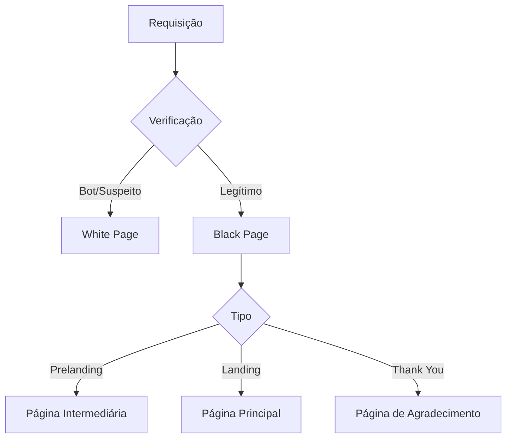
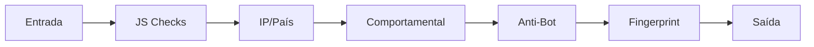
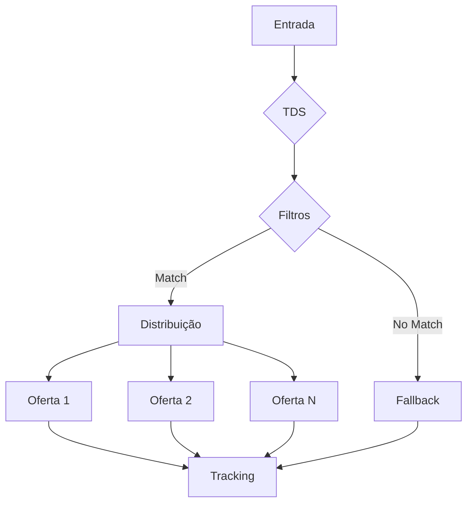

# Documentação do Sistema de Cloaking

## Índice Geral

### 1. [White Page Setup](1_white_page_setup.md)

- Visão Geral
- Métodos de Entrega (Folder, Redirect, CURL, Error)
- Configurações Específicas por Domínio
- Verificações JavaScript
- Considerações de Segurança

### 2. [Black Page Setup](2_black_page_setup.md)

- Visão Geral
- Estrutura do Sistema
- Prelanding Pages
- Landing Pages
- Thank You Pages
- Sistema de Upsell
- Integrações com Pixels

### 3. [Regras de Bloqueio](3_blocking_rules.md)

- Visão Geral
- Tipos de Bloqueio
- Fluxo de Verificação
- Regras Avançadas
- Sistema de Pontuação
- Considerações de Implementação

### 4. [Tracking e Analytics](4_tracking_analytics.md)

- Visão Geral
- Pixels de Rastreamento
- Sistema de Postback
- Métricas e KPIs
- Sistema de Logs
- Integrações

#### 4.1 [Sistema de Distribuição de Tráfego (TDS)](4.1_traffic_distribution_system.md)

- Regras de Distribuição
- Filtros de Tráfego
- Sistema de Pesos
- Otimização Automática
- Monitoramento em Tempo Real
- Integração com Tracking

##### 4.1.1 [Fluxo Detalhado do TDS](4.1.1_tds_sequence_flow.md)

- Diagrama de Sequência
- Detalhamento dos Participantes
- Estados do Sistema
- Estrutura do Banco de Dados
- Exemplos de Payload

### 5. [Segurança e Proteção](5_security_protection.md)

- Visão Geral
- Camadas de Proteção
- Sistema Anti-Bot
- Criptografia e Ofuscação
- Proteção de Arquivos
- Monitoramento de Segurança

### 6. [Sistema e Ambiente](6_system_environment.md)

- Visão Geral
- Configurações do Servidor
- Estrutura de Diretórios
- Variáveis de Ambiente
- Sistema de Arquivos
- Configurações de Rede
- Gerenciamento de Processos

### 7. [Configuração e Funcionamento em Subpastas](subpasta_servidor.md)

- Problema de Redirecionamento em Subpastas
- Soluções Implementadas
- Testes de Funcionamento
- Métodos de Implantação
- Considerações Importantes

## Diagramas Principais

### Fluxo de Requisição

### Camadas de Proteção

### Fluxo do TDS

