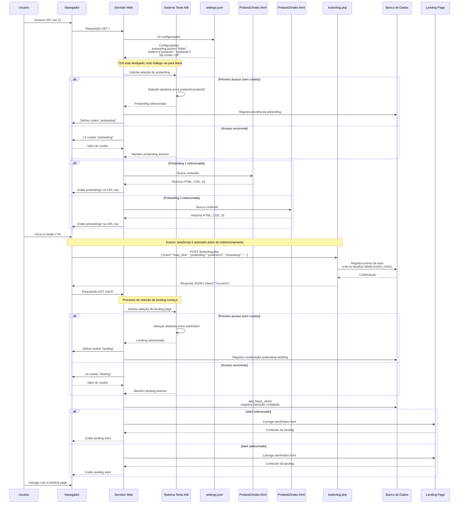

# Diagrama de Sequência - Teste A/B com Tracking de Leads via JavaScript

## Descrição do Caso de Uso

Este documento descreve o fluxo completo do teste A/B entre duas páginas de
prelanding (preland1 e preland2) e duas landing pages (site3 e site4), onde
eventos de lead são registrados via JavaScript no momento do clique no botão
CTA.

## Diagrama de Sequência

## Detalhamento do Fluxo de Dados

### 1. Requisição Inicial

- **Estado Inicial**: Usuário realiza requisição HTTP para o site
- **Dados da Requisição**:
  - URL: `GET /`
  - Headers HTTP: User-Agent, Accept, Cookie (se existir)
- **Fonte de Dados**: settings.json
- **Dados Consultados**:
  - `prelanding.action = "folder"`
  - `prelanding.folders = ["preland1", "preland2"]`
  - `tds.mode = "off"`
- **Mudança de Estado**: Sistema entra em modo de seleção de prelanding

### 2. Seleção de Prelanding

- **Estado**: Sistema decidindo qual prelanding exibir
- **Fonte de Dados**:
  - Cookies: Verificação de "prelanding"
  - Função `select_prelanding()` em abtest.php
- **Processamento**:
  - Se cookie existe: Reusa valor existente
  - Se não existe: Seleciona aleatoriamente (preland1 ou preland2)
- **Dados Gerados**:
  - Cookie "prelanding" com valor selecionado
  - Registro no banco de dados (BD) da seleção
- **Mudança de Estado**: Prelanding determinada para exibição

### 3. Exibição da Prelanding

- **Estado**: Sistema servindo a prelanding
- **Dados Retornados ao Usuário**:
  - HTML da prelanding selecionada
  - CSS e recursos associados
  - JavaScript para tracking
- **Fonte de Dados**: Arquivo index.html da pasta selecionada (preland1/ ou
  preland2/)
- **Mudança de Estado**: Usuário visualizando prelanding na URL raiz

### 4. Evento de Clique no CTA

- **Estado**: Usuário clicando no botão "Continue para a Landing Page"
- **Processamento**: Script JavaScript acionado pelo evento de clique
- **Dados Enviados**:
  - Requisição `POST /buttonlog.php`
  - Conteúdo JSON:
    `{"event":"lead_click", "prelanding":"preland1/2", "timestamp":"..."}`
- **Fonte de Dados**: buttonlog.php
- **Processamento no Servidor**:
  - Parsing dos dados JSON
  - Geração de SQL para inserção na tabela
- **Dados Armazenados**:
  - Tabela `button_clicks`: id, subid, event, prelanding, timestamp
- **Mudança de Estado**: Lead registrado, navegação para landing iniciada

### 5. Seleção de Landing Page

- **Estado**: Sistema decidindo qual landing exibir
- **Dados da Requisição**:
  - URL: `GET /site3/`
  - Cookies: prelanding, outros cookies existentes
- **Fonte de Dados**:
  - Cookies: Verificação de "landing"
  - settings.json: `landing.folder.names = ["site3", "site4"]`
  - Função `select_landing()` em abtest.php
- **Processamento**:
  - Se cookie "landing" existe: Reusa valor existente
  - Se não existe: Seleciona aleatoriamente (site3 ou site4)
- **Dados Gerados**:
  - Cookie "landing" com valor selecionado
  - Registro no BD da combinação prelanding+landing
- **Mudança de Estado**: Landing determinada para exibição

### 6. Exibição da Landing

- **Estado**: Sistema servindo a landing
- **Dados Retornados ao Usuário**:
  - HTML da landing selecionada
  - CSS e recursos associados
- **Fonte de Dados**: Arquivo index.html da pasta selecionada (site3/ ou site4/)
- **Mudança de Estado Final**: Usuário visualizando landing

## Fontes de Dados Envolvidas

1. **Arquivos de Configuração**
   - `settings.json`: Configuração geral do sistema
     - Definição das prelandings disponíveis
     - Definição das landings disponíveis
     - Configuração do TDS (desligado neste caso)

2. **Banco de Dados**
   - Tabela `button_clicks`: Registro de eventos de lead via JS
     - Colunas: id, subid, event, prelanding, timestamp
   - Tabela `clicks`: Registro de transições entre páginas
     - Dados sobre qual prelanding e landing foram selecionadas

3. **Cookies no Navegador**
   - "prelanding": Armazena qual prelanding foi mostrada
   - "landing": Armazena qual landing será/foi mostrada

4. **Arquivos HTML/JS**
   - `preland1/index.html` e `preland2/index.html`: Contêm código JS para
     tracking
   - `buttonlog.php`: Endpoint para receber eventos de lead via AJAX

## Considerações Importantes

1. O TDS está configurado como "off", direcionando todo o tráfego para o fluxo
   black (teste A/B completo).

2. O parâmetro `saveuserflow` está habilitado, garantindo que o mesmo usuário
   veja a mesma variante em visitas subsequentes.

3. O registro de leads acontece em dois momentos:
   - No clique do botão CTA via JavaScript (evento assíncrono)
   - Na transição entre prelanding e landing via PHP (função add_black_click)

4. Qualquer uma das duas landings (site3 ou site4) pode ser exibida
   independentemente de qual prelanding foi mostrada, criando quatro combinações
   possíveis para teste.
