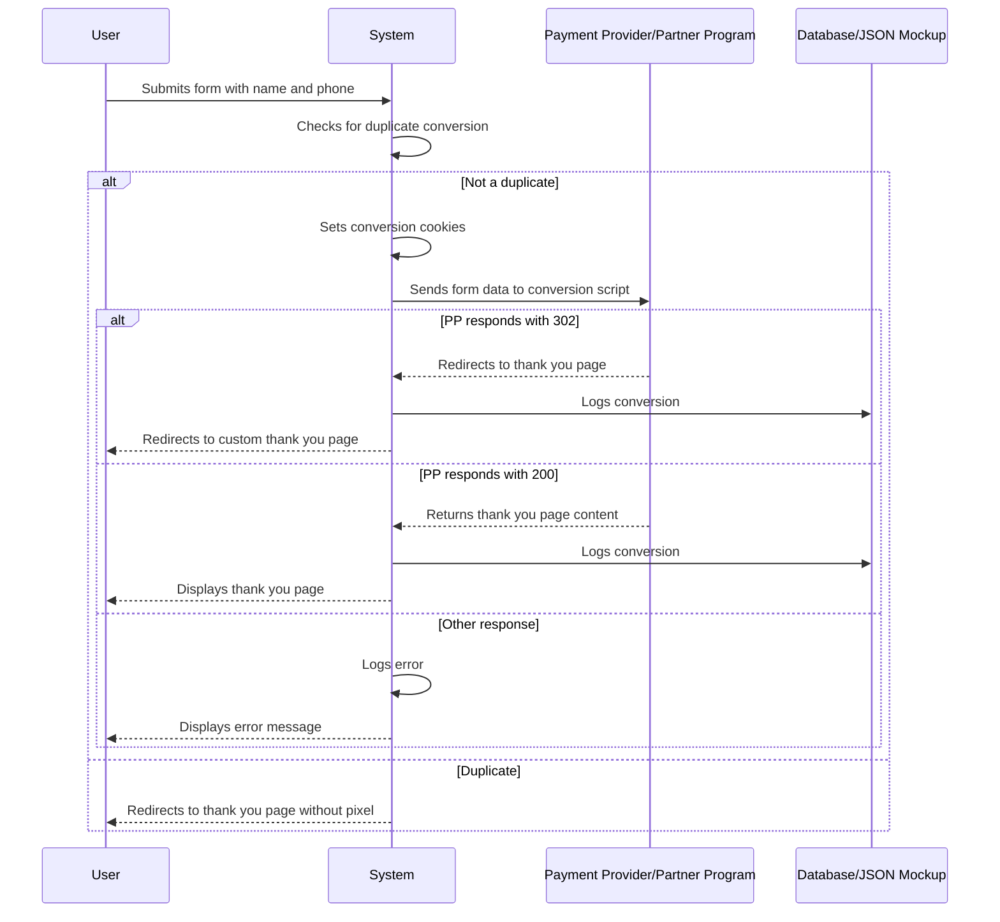

# Sequence Diagram for Conversion Registration

# Supporting Documentation

## Roles and Responsibilities

- **User**: Submits the form with personal information to register a conversion.
- **System**: Processes the form submission, checks for duplicates, sets cookies, sends data to the PP, and handles the response.
- **Payment Provider/Partner Program (PP)**: Receives the form data and processes the conversion, returning a response to the system.
- **Database/JSON Mockup**: Stores the conversion data for future reference.

## Request and Response Content

- **User to System**:
  - **Form Submission**: Includes name and phone number.

- **System to System**:
  - **Duplicate Check**: Uses the `has_conversion_cookies` function to check if the conversion is a duplicate.
  - **Cookie Setting**: Sets cookies for the user's name, phone, and conversion timestamp.

- **System to PP**:
  - **Form Data**: Sends the form data to the conversion script specified by `$black_land_conversion_script`.

- **PP to System**:
  - **HTTP Response**: Returns an HTTP response code (302, 200, or other) and potentially a redirect URL or thank you page content.

- **System to Database**:
  - **Conversion Logging**: Logs the conversion data, including the subid, name, and phone number.

- **System to User**:
  - **Redirect to Thank You Page**: Redirects the user to a custom thank you page if using KLO, or to the PP's thank you page if using PP.
  - **Display Thank You Page**: Displays the thank you page content returned by the PP.
  - **Error Message**: Displays an error message if the PP's response is not as expected.

## Additional Context

- **Conversion Script**: The script used to send form data to the PP is specified by the `$black_land_conversion_script` variable. This can be a local script or a URL.
- **Subid Handling**: The system checks and potentially sets the subid before sending the form data to the PP.

## When to Use PP or KLO

- **PP (Payment Provider/Partner Program)**:
  - Use when you want to leverage the PP's thank you page and conversion tracking capabilities.
  - Suitable for scenarios where the PP handles the conversion tracking and provides a thank you page.
  - Requires configuration of the conversion script and tracking pixels.

- **KLO (Keitaro Landing Optimization)**:
  - Use when you need more control over the thank you page and conversion tracking.
  - Suitable for scenarios where you want to customize the thank you page and handle conversion tracking locally.
  - Does not require a separate conversion script, as the system handles it internally.

This documentation covers the process of registering a conversion, starting from `index.php`, and details the roles, data flow, and state changes involved in the process.
