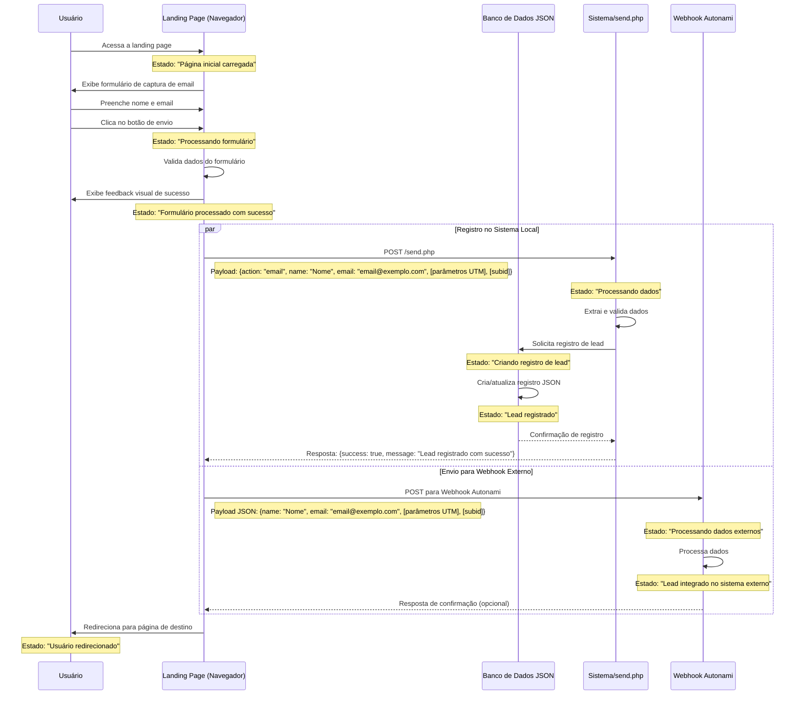

# Diagrama de Sequência: Captura de Email e Integração com Webhook Autonami



## Detalhes das Requisições, Respostas e Fontes de Dados

### Fontes de Dados

1. **Banco de Dados JSON Local**
   - **Localização**: `/logs/leads/data/*.json`
   - **Estrutura**:
     ```json
     {
       "subid": "hash_identificador_único",
       "time": 1742147033,
       "name": "Nome do Usuário",
       "phone": "00000000000",
       "status": "Lead",
       "email": "usuario@exemplo.com",
       "fbp": "fb.0.timestamp.id",
       "fbclid": "",
       "preland": "unknown",
       "land": "unknown",
       "_id": 12
     }
     ```

2. **Sistema Externo Autonami**
   - **Tipo**: Sistema de marketing automation
   - **Endpoint**: Webhook REST API

### Acesso à Landing Page

- **Requisição**:
  - Método: `GET`
  - URL: `/offer2/index.html`
- **Resposta**:
  - Status: 200
  - Conteúdo: HTML da página com formulário de captura de email
- **Estado**: Página inicial carregada

### Envio do Formulário (Cliente para Sistema Local)

- **Requisição**:
  - Método: `POST`
  - URL: `/send.php`
  - Headers: `Content-Type: application/x-www-form-urlencoded`
  - Corpo:
    ```
    action=email&name=Nome+do+Usuário&email=usuario@exemplo.com&[parâmetros UTM]&subid=[se disponível]
    ```
- **Processamento**:
  1. Validação de dados de entrada
  2. Geração/recuperação de subid
  3. Registro no banco de dados JSON
- **Resposta**:
  - Status: 200
  - Corpo:
    ```json
    {
      "success": true,
      "message": "Lead registrado com sucesso",
      "subid": "hash_id",
      "name": "Nome do Usuário",
      "email": "usuario@exemplo.com"
    }
    ```
- **Estados**:
  1. Processando dados
  2. Lead registrado no banco local

### Envio para Webhook Externo

- **Requisição**:
  - Método: `POST`
  - URL:
    `https://dekoola.com/wp-json/autonami/v1/webhook/?bwfan_autonami_webhook_id=10&bwfan_autonami_webhook_key=92c39df617252d128219dba772cff29a`
  - Headers: `Content-Type: application/json`
  - Corpo:
    ```json
    {
      "name": "Nome do Usuário",
      "email": "usuario@exemplo.com",
      "[parâmetro UTM]": "[valor]",
      "subid": "[subid]"
    }
    ```
- **Processamento**:
  1. Recebimento e validação de dados
  2. Integração no sistema de automação de marketing
- **Resposta**:
  - Status: 200
  - Confirmação de recebimento (depende da configuração do webhook)
- **Estados**:
  1. Processando dados externos
  2. Lead integrado no sistema externo

### Redirecionamento do Usuário

- **Ação**: Redirecionamento via JavaScript (`window.location.href`)
- **Destino**: `https://dekoola.com/ch/hack/` (com parâmetros originais da URL)
- **Timing**: 3 segundos após processamento do formulário
- **Estado**: Usuário redirecionado
