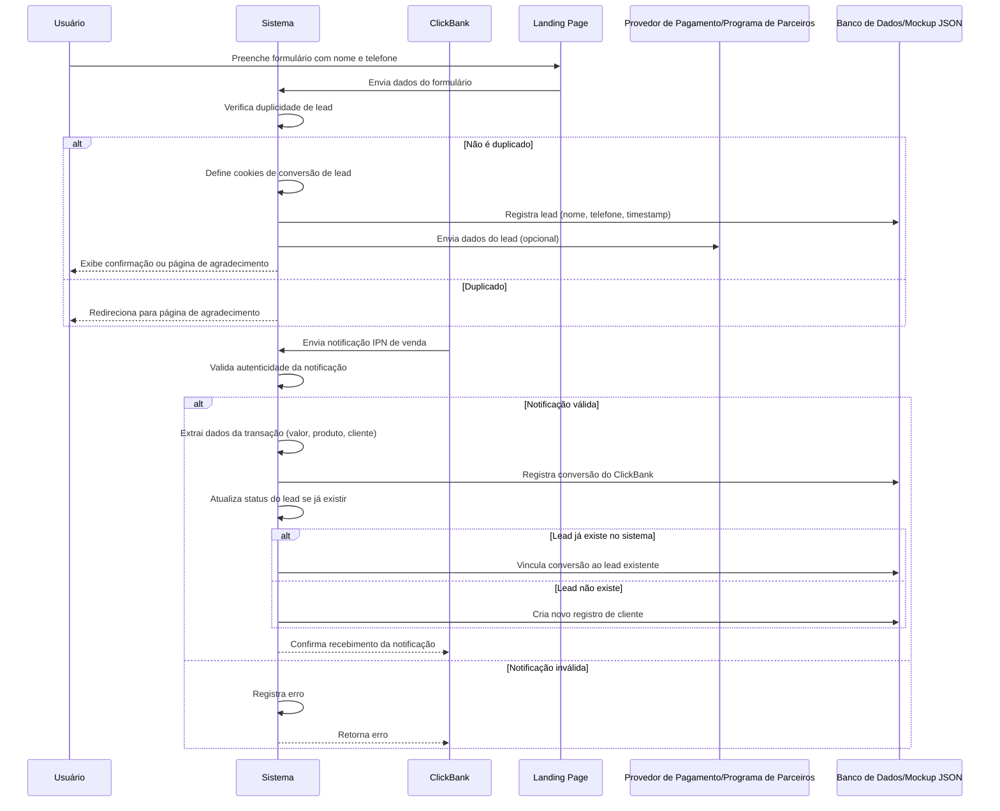
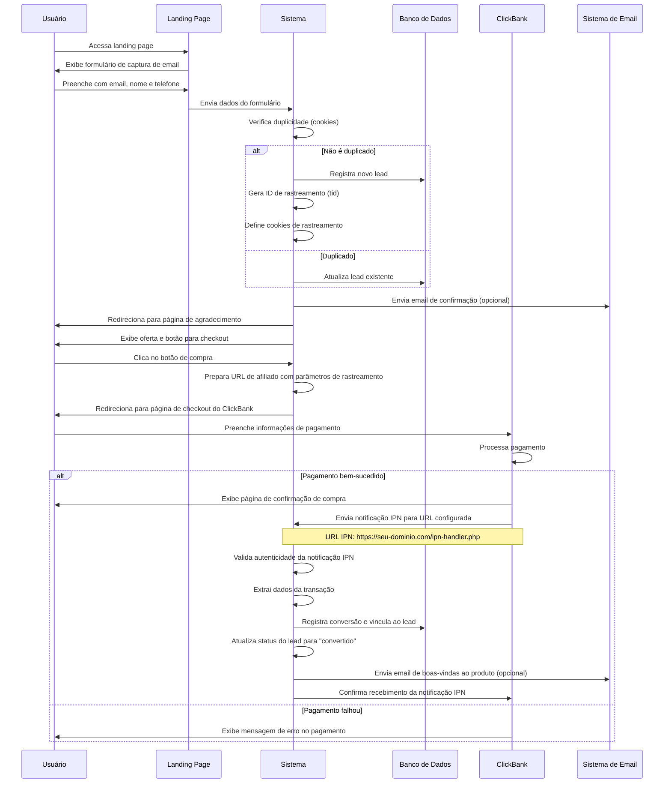

# Diagrama de Sequência para Registro de Conversão



# Documentação de Suporte

## Papéis e Responsabilidades

- **Usuário**: Preenche o formulário com informações pessoais para registrar um
  lead.
- **Sistema**: Processa o envio do formulário, verifica duplicidades, configura
  cookies, gerencia notificações do ClickBank, e registra conversões.
- **ClickBank (CB)**: Plataforma de afiliados que envia notificações IPN
  (Instant Payment Notification) quando uma venda é realizada.
- **Landing Page (LP)**: Página que contém o formulário de captura de leads.
- **Provedor de Pagamento/Programa de Parceiros (PP)**: Recebe os dados do
  formulário e processa a conversão inicial de lead.
- **Banco de Dados/Mockup JSON (BD)**: Armazena os dados de leads e conversões
  para referência futura.

## Conteúdo das Requisições e Respostas

### Registro de Lead pelo Formulário:

- **Usuário para Landing Page**:
  - **Submissão do Formulário**: Inclui nome, telefone e possivelmente outros
    campos.

- **Landing Page para Sistema**:
  - **Dados do Formulário**: Envia os dados capturados para processamento.

- **Sistema para Sistema**:
  - **Verificação de Duplicidade**: Usa a função `has_conversion_cookies` para
    verificar se o lead já foi registrado.
  - **Configuração de Cookies**: Define cookies para o nome, telefone e
    timestamp da conversão do lead.

- **Sistema para Banco de Dados**:
  - **Registro de Lead**: Armazena os dados do lead, incluindo subid, nome e
    telefone.

- **Sistema para Usuário**:
  - **Redirecionamento para Página de Agradecimento**: Redireciona o usuário
    para uma página de agradecimento personalizada.

### Registro de Conversão via ClickBank:

- **ClickBank para Sistema**:
  - **Notificação IPN**: Envia uma notificação contendo dados da transação
    (valor, produto, cliente).

- **Sistema para Sistema**:
  - **Validação da Notificação**: Verifica a autenticidade da notificação IPN
    usando a chave secreta.
  - **Extração de Dados**: Extrai informações relevantes da notificação.

- **Sistema para Banco de Dados**:
  - **Registro de Conversão**: Armazena os dados da conversão do ClickBank.
  - **Atualização de Lead**: Atualiza o status do lead para "convertido" se o
    lead já existir.

- **Sistema para ClickBank**:
  - **Confirmação de Recebimento**: Envia confirmação de processamento da
    notificação.

## Contexto Adicional

- **Script de Conversão de Lead**: O script usado para enviar dados do
  formulário é especificado pela variável `$black_land_conversion_script`.
- **Manipulação de Subid**: O sistema verifica e potencialmente configura o
  subid antes de enviar os dados do formulário.
- **Integração com ClickBank**: O sistema processa notificações IPN do ClickBank
  para registrar vendas realizadas.

## Quando Usar PP ou KLO

- **PP (Provedor de Pagamento/Programa de Parceiros)**:
  - Use quando quiser aproveitar a página de agradecimento e recursos de
    rastreamento de conversão do PP.
  - Adequado para cenários onde o PP gerencia o rastreamento de conversão e
    fornece uma página de agradecimento.
  - Requer configuração do script de conversão e pixels de rastreamento.

- **KLO (Keitaro Landing Optimization)**:
  - Use quando precisar de mais controle sobre a página de agradecimento e
    rastreamento de conversão.
  - Adequado para cenários onde você deseja personalizar a página de
    agradecimento e gerenciar o rastreamento de conversão localmente.
  - Não requer um script de conversão separado, pois o sistema o gerencia
    internamente.

- **ClickBank**:
  - Use para registrar conversões de vendas processadas através da plataforma
    ClickBank.
  - Requer configuração do IPN (Instant Payment Notification) no painel do
    ClickBank.
  - Permite vincular conversões de vendas a leads previamente capturados.

Esta documentação abrange o processo de registro de leads através do formulário
da landing page e o registro de conversões recebidas do ClickBank, detalhando os
papéis, fluxo de dados e mudanças de estado envolvidas no processo.

# Fluxo Completo: Captura de Lead até Conversão no ClickBank



## Configuração da URL IPN no ClickBank

Para configurar corretamente o recebimento de notificações IPN do ClickBank:

1. Acesse sua conta de vendedor no ClickBank
2. Navegue até **Configurações da Conta** > **Configurações Avançadas** >
   **Notificações de Pagamento Instantâneo**
3. Configure a URL para onde o ClickBank enviará as notificações, geralmente:
   ```
   https://seu-dominio.com/ipn-handler.php
   ```
4. Selecione os eventos para os quais deseja receber notificações (SALE, RFND,
   BILL, etc.)
5. Defina parâmetros adicionais como segurança, formato da notificação
   (JSON/XML)
6. Salve as configurações

## Parâmetros importantes para rastreamento

Para vincular corretamente as conversões aos leads, é essencial incluir
parâmetros de rastreamento na URL do ClickBank:

- **tid**: ID de rastreamento único do lead em seu sistema
- **subid**: Pode ser usado para rastrear a fonte do tráfego
- **email**: Endereço de email do lead (codificado para URL)
- **name**: Nome do lead (codificado para URL)

Exemplo de URL de redirecionamento para checkout:

```
https://[VENDEDOR].clickbank.net/?tid=[ID_RASTREAMENTO]&subid=[SUBID]&name=[NOME_CODIFICADO]&email=[EMAIL_CODIFICADO]
```

## Relação entre PP, KLO e Cloaker

- **Cloaker**: Sistema que direciona tráfego com base em regras predefinidas.
- **PP (Provedor de Pagamento)**: Sistema externo de processamento de
  pagamentos.
- **KLO (Keitaro Landing Optimization)**: Recurso de otimização de landing pages
  do Keitaro.

Estes sistemas **não** são partes integrantes uns dos outros, mas componentes
que interagem entre si na arquitetura completa de conversão e rastreamento.
