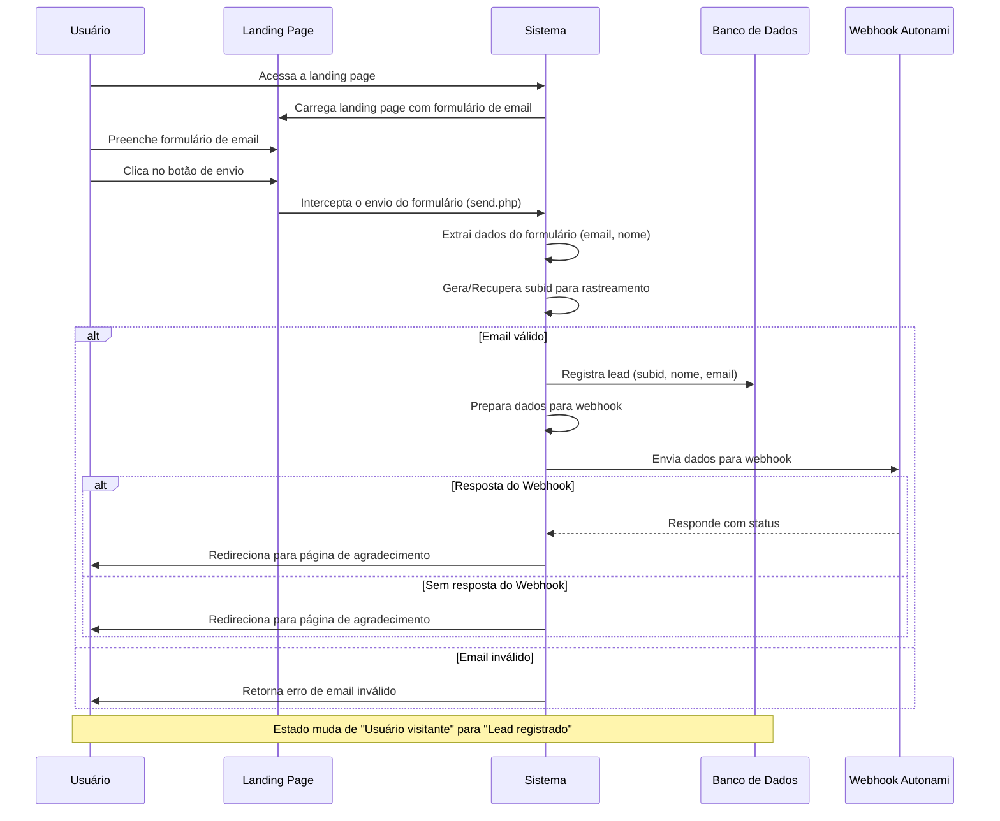

# Diagrama de Sequência para Captura de Email e Integração com send.php



## Detalhes das Requisições e Respostas

### Acesso à Landing Page:

- **Requisição**: O usuário acessa a URL da landing page.
- **Processamento**: O sistema carrega a landing page com o formulário de email.
- **Resposta**: A landing page é exibida com o formulário de email.

### Envio do Formulário:

- **Requisição**: Usuário submete o formulário com dados como email e nome.
- **Dados**:
  ```
  {
    "email": "usuario@example.com",
    "name": "Nome do Usuário"
  }
  ```
- **Processamento**:
  1. O sistema intercepta o envio através do arquivo `send.php`.
  2. Extrai dados como email e nome do formulário.
  3. Gera/recupera o subid para rastreamento.

### Registro de Lead e Envio para Webhook:

- **Dados**:
  ```
  {
    "subid": "abc123xyz789",
    "email": "usuario@example.com",
    "name": "Nome do Usuário"
  }
  ```
- **Processamento**:
  1. Registra o lead no banco de dados.
  2. Prepara os dados para o webhook.
  3. Envia os dados para o webhook Autonami.
  4. Recebe a resposta do webhook e redireciona o usuário para a página de agradecimento.

### Configuração e Requisitos

1. **Validação de Email**:
   - O sistema deve validar o email antes de processar o lead.

2. **Integração com Webhook**:
   - O sistema deve enviar os dados do lead para o webhook especificado.

3. **Rastreamento**:
   - O subid é usado para rastrear a origem do lead.
