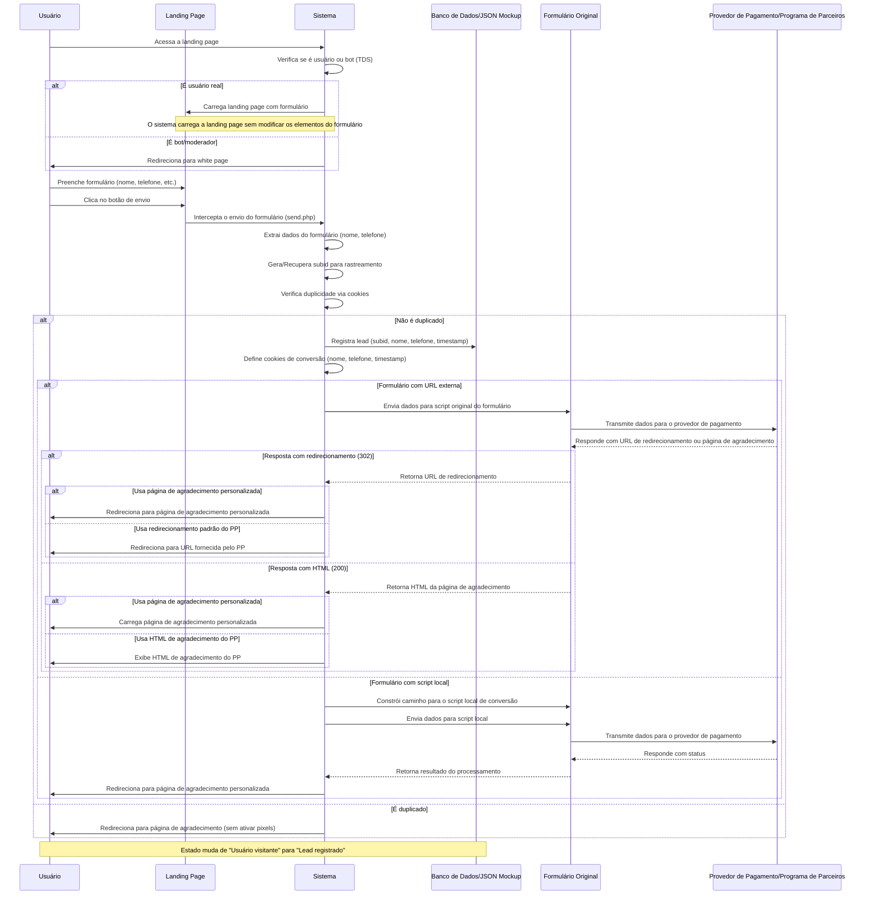

# Diagrama de Sequência para Integração de Formulário na Landing Page



## Documentação de Suporte

### Papéis e Responsabilidades

- **Usuário**: Preenche o formulário na landing page para registrar seu
  interesse.
- **Sistema**: Responsável por interceptar o envio do formulário, processar os
  dados e garantir que sejam enviados ao script original sem modificar os
  elementos do formulário.
- **Landing Page (LP)**: Página contendo o formulário de captura de leads.
- **Formulário Original**: O formulário original que existe na landing page,
  cujos elementos não devem ser alterados.
- **Banco de Dados/JSON Mockup (BD)**: Armazena os dados de leads para
  referência futura.
- **Provedor de Pagamento/Programa de Parceiros (PP)**: Sistema externo que
  recebe os dados do formulário.

### Detalhes das Requisições e Respostas

#### Acesso à Landing Page:

- **Requisição**: O usuário acessa a URL da landing page.
- **Processamento**: O sistema verifica se é um usuário real ou bot através do
  TDS (Traffic Distribution System).
- **Resposta**: Para usuários reais, carrega a landing page com o formulário
  intacto. Para bots, redireciona para white page.

#### Envio do Formulário:

- **Requisição**: Usuário submete o formulário com dados como nome e telefone.
- **Dados**:
  ```
  {
    "name": "Nome do Usuário",
    "phone": "+55123456789",
    ... (outros campos do formulário)
  }
  ```
- **Processamento**:
  1. O sistema intercepta o envio através do arquivo `send.php`
  2. Extrai dados como nome e telefone de diferentes possíveis campos do
     formulário
  3. Gera/recupera o subid para rastreamento
  4. Verifica se o lead já foi registrado anteriormente usando cookies

#### Registro de Lead (para leads não duplicados):

- **Dados**:
  ```
  {
    "subid": "abc123xyz789",
    "name": "Nome do Usuário",
    "phone": "+55123456789",
    "timestamp": 1647432871
  }
  ```
- **Cookies Definidos**:
  - `name`: Nome do usuário
  - `phone`: Telefone do usuário
  - `ctime`: Timestamp da conversão

#### Processamento Baseado no Tipo de Formulário:

- **Para formulários com URL externa**:
  - **Requisição para PP**: Envia todos os dados do formulário para a URL
    externa
  - **Resposta possível (302)**: PP responde com URL de redirecionamento
  - **Resposta possível (200)**: PP responde com HTML da página de agradecimento

- **Para formulários com script local**:
  - **Requisição para script local**: Constrói caminho relativo e envia dados
  - **Processamento**: Script local processa os dados e comunica com o PP

### Configuração e Requisitos

1. **Não alteração dos elementos do formulário**:
   - O sistema deve processar o formulário sem modificar seus campos ou
     atributos visuais
   - A integração ocorre pela interceptação do envio, não pela modificação do
     HTML

2. **Reutilização do script original**:
   - O sistema deve continuar usando o script original de processamento do
     formulário
   - Se o action do formulário for uma URL externa, os dados são enviados para
     esta URL
   - Se for um script local, o sistema constrói o caminho completo e envia os
     dados para ele

3. **Tratamento de duplicidades**:
   - O sistema identifica leads duplicados através de cookies
   - Leads duplicados são redirecionados para a página de agradecimento sem
     reenvio ao PP

4. **Rastreamento**:
   - O subid é usado para rastrear a origem do lead
   - O sistema verifica se o subid está presente nos dados do formulário antes
     do envio

```
```
