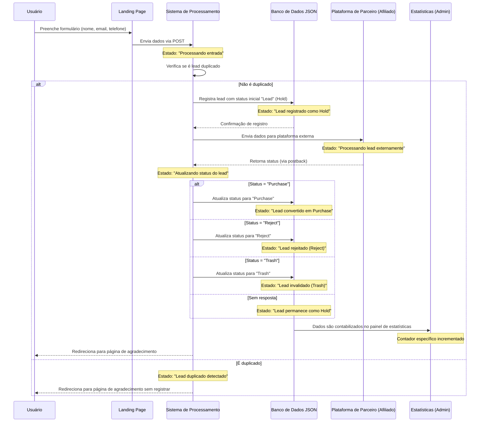

# Fluxo de Processamento de Leads e Estados do Sistema

## Diagrama de Sequência: Ciclo de Vida de um Lead e Transições de Estado

## Explicação dos Status de Leads

### 1. Hold (Lead)

O status "Hold" (também identificado como "Lead" no sistema) representa leads recém-capturados que ainda não passaram por todo o processo de validação ou conversão. São leads em estado de espera.

**Características:**
- Representa o estado inicial de um lead após seu registro no sistema
- Lead está aguardando processamento ou validação adicional
- Ainda não foi aceito ou rejeitado pela plataforma externa
- Em algumas situações, pode representar leads em análise manual

**Quando ocorre contabilização:**
- Quando um usuário preenche o formulário com dados válidos
- Quando o lead é registrado mas ainda não recebeu confirmação de status final
- Quando a plataforma externa mantém o lead em análise

### 2. Reject

O status "Reject" indica leads que foram explicitamente rejeitados pela plataforma externa, tipicamente por não cumprirem critérios de qualidade ou elegibilidade.

**Características:**
- Lead foi validado, mas não atendeu aos critérios de aceitação
- Problema identificado com os dados do lead (qualidade insuficiente)
- Lead não é elegível para o programa ou oferta específica
- Lead pode ter sido bloqueado por motivos de compliance ou fraude

**Quando ocorre contabilização:**
- Quando a plataforma externa retorna explicitamente o status "Reject"
- Quando o sistema de validação identifica problemas nos dados fornecidos
- Quando regras de negócio específicas determinam a rejeição do lead

### 3. Trash

O status "Trash" representa leads considerados inválidos, fraudulentos ou de baixíssima qualidade, que são completamente descartados do processo.

**Características:**
- Lead contém dados claramente inválidos ou fictícios
- Comportamento identificado como potencialmente fraudulento
- Lead não pode ser processado por problemas técnicos irreparáveis
- Dados incompletos ou incoerentes que impossibilitam qualquer processamento

**Quando ocorre contabilização:**
- Quando a plataforma externa classifica o lead como inválido/fraudulento
- Quando sistemas automáticos de validação detectam padrões de fraude
- Quando o lead falha em validações básicas (ex: formato de email inválido)
- Quando o IP ou outros identificadores estão em listas de bloqueio

## Diferenças e Implicações na Contabilização

| Status | Contabilização em Estatísticas | Significado para o Negócio | Ações Possíveis |
|--------|--------------------------------|----------------------------|-----------------|
| **Hold (Lead)** | Contabilizado na coluna "Hold" | Lead com potencial, mas ainda não processado | Acompanhar progresso, enviar lembretes |
| **Purchase** | Contabilizado na coluna "Purchase" | Lead convertido em venda ou ação desejada | Processar comissão, iniciar onboarding |
| **Reject** | Contabilizado na coluna "Reject" | Lead válido mas recusado por critérios específicos | Analisar motivos, ajustar segmentação |
| **Trash** | Contabilizado na coluna "Trash" | Lead inválido que não deve ser considerado | Ajustar filtros, investigar fontes problemáticas |

### Métricas Calculadas

O sistema calcula automaticamente métricas baseadas nestes status:

- **CR% all**: Taxa de conversão geral (todas as conversões divididas por cliques únicos)
- **CR% sales**: Taxa de conversão para vendas (apenas "Purchase" dividido por cliques únicos)
- **App% (w/o trash)**: Taxa de aprovação excluindo leads "Trash" (Purchase ÷ (Lead + Purchase + Reject))
- **App% (total)**: Taxa de aprovação incluindo todos os leads (Purchase ÷ Total de leads)

## Fluxo de Dados e Interações com o Banco de Dados

1. **Registro Inicial**
   - Função `add_lead()` em `db.php` registra o lead com status inicial "Lead" (Hold)
   - Os dados são armazenados no banco NoSQL SleekDB em `/logs/leads/`

2. **Atualização de Status**
   - Função `update_lead_status()` ou `update_lead()` atualiza o status quando recebe postback
   - O sistema mantém o histórico do lead, apenas modificando seu status

3. **Contabilização em Estatísticas**
   - O script `statistics.php` na área administrativa lê os dados do banco
   - Realiza contagem por status e calcula métricas relevantes
   - Apresenta os dados nas colunas correspondentes da tabela de estatísticas

## Recomendações para Otimização

1. **Redução de "Hold"**
   - Implementar validação em tempo real para acelerar o processamento
   - Configurar webhooks para atualizações automáticas de status
   - Estabelecer tempo máximo para leads em "Hold" antes de reclassificação

2. **Análise de "Reject"**
   - Monitorar padrões nos leads rejeitados para identificar problemas sistemáticos
   - Ajustar segmentação de tráfego para reduzir rejeições
   - Solicitar feedback detalhado da plataforma externa sobre motivos de rejeição

3. **Mitigação de "Trash"**
   - Implementar validações mais rigorosas no front-end
   - Utilizar serviços de verificação de email e telefone em tempo real
   - Implementar sistemas de detecção de fraude para bloquear submissões suspeitas 