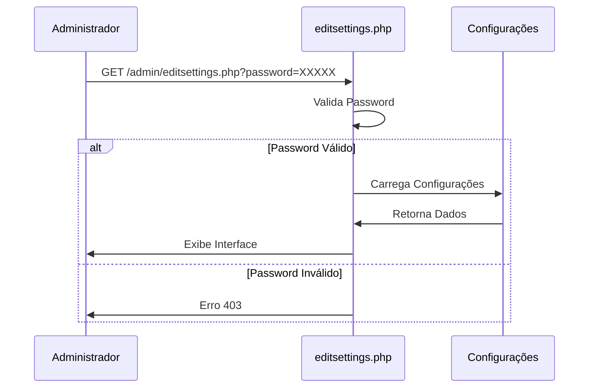
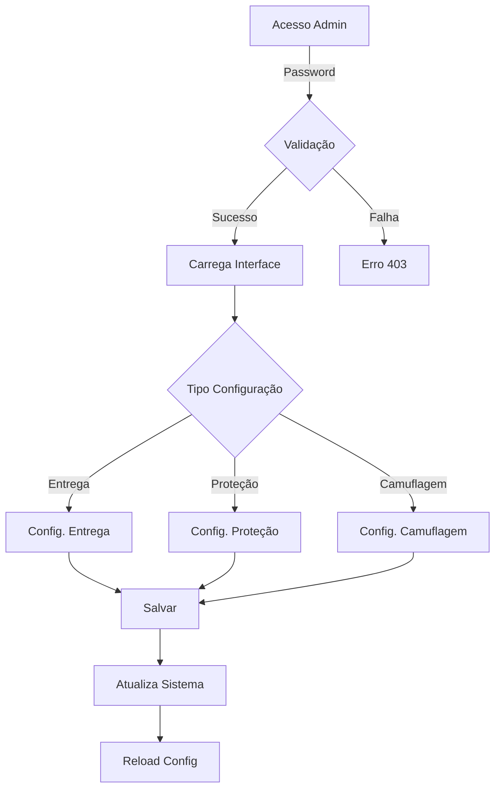
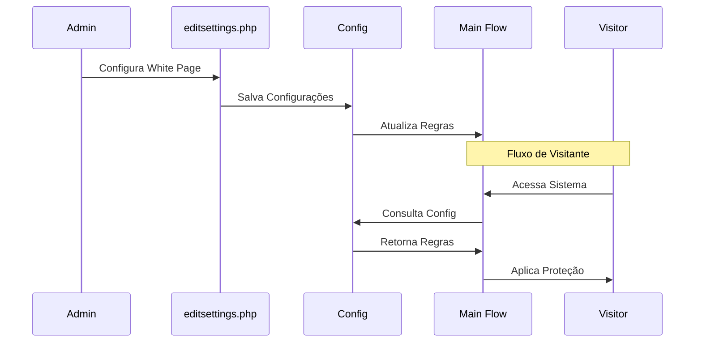

# Interface Administrativa da White Page

## Sumário

1. [Visão Geral](#visão-geral)
2. [Acesso à Interface](#acesso-à-interface)
3. [Estrutura da Interface](#estrutura-da-interface)
4. [Configurações Disponíveis](#configurações-disponíveis)
5. [Fluxo de Execução](#fluxo-de-execução)
6. [Exemplos Práticos](#exemplos-práticos)
7. [Considerações de Segurança](#considerações-de-segurança)
8. [Boas Práticas](#boas-práticas)

## Visão Geral

A interface administrativa da White Page (`editsettings.php`) é o componente
central para configuração do conteúdo apresentado a visitantes não qualificados,
bots e moderadores. Esta interface permite gerenciar todos os aspectos
relacionados à proteção e camuflagem do sistema.

## Acesso à Interface

### Endpoint

```
http://localhost:8000/admin/editsettings.php?password=XXXXX
```

### Autenticação

- Método: GET Parameter
- Parâmetro: `password`
- Localização: Query String
- Tipo: String (MD5 hash no backend)



## Estrutura da Interface

### Seções Principais

1. **Configurações de Entrega**
   ```json
   {
       "white": {
           "action": "string",
           "method": "string",
           "source": {
               "type": "string",
               "location": "string"
           },
           "options": {
               "js_checks": "boolean",
               "delay": "number",
               "headers": ["string"]
           }
       }
   }
   ```

2. **Configurações de Proteção**
   ```json
   {
       "protection": {
           "enabled": "boolean",
           "methods": ["string"],
           "rules": {
               "ip_ranges": ["string"],
               "user_agents": ["string"],
               "countries": ["string"]
           }
       }
   }
   ```

3. **Configurações de Camuflagem**
   ```json
   {
       "cloaking": {
           "mode": "string",
           "custom_headers": {
               "enabled": "boolean",
               "list": ["string"]
           },
           "dynamic_content": {
               "enabled": "boolean",
               "refresh_rate": "number"
           }
       }
   }
   ```

## Configurações Disponíveis

### 1. Método de Entrega

#### 1.1 Pasta Local

```php
white.action = 'folder'
white.folder.names = 'white1,white2'
white.folder.random = true
```

#### 1.2 Redirecionamento

```php
white.action = 'redirect'
white.redirect.urls = 'https://site.com'
white.redirect.type = '301'
```

#### 1.3 CURL

```php
white.action = 'curl'
white.curl.urls = 'https://site.com'
white.curl.headers = ['User-Agent', 'Accept']
```

#### 1.4 Erro HTTP

```php
white.action = 'error'
white.error.code = '404'
white.error.message = 'Página não encontrada'
```

### 2. Configurações de Proteção

```php
white.protection = [
    'ip_ranges' => ['192.168.0.0/24'],
    'user_agents' => ['*bot*', '*crawler*'],
    'countries' => ['US', 'GB'],
    'referers' => ['*google*', '*facebook*']
]
```

## Fluxo de Execução



## Exemplos Práticos

### Exemplo 1: Configuração Básica

```php
// Configuração de pasta local com proteção básica
white.action = 'folder'
white.folder.names = 'white_default'
white.protection.enabled = true
white.protection.methods = ['ip', 'ua']
```

### Exemplo 2: Configuração Avançada

```php
// Configuração CURL com camuflagem avançada
white.action = 'curl'
white.curl.url = 'https://site.com'
white.curl.headers = ['User-Agent', 'Accept']
white.cloaking.mode = 'advanced'
white.cloaking.custom_headers.enabled = true
white.cloaking.custom_headers.list = [
    'X-Forwarded-For: {random_ip}',
    'Accept-Language: {country_language}'
]
```

## Considerações de Segurança

### 1. Proteção de Acesso

- Rate limiting por IP
- Logging de tentativas
- Rotação de senha
- Bloqueio após falhas

### 2. Validação de Dados

- Sanitização de inputs
- Validação de URLs
- Verificação de domínios
- Proteção contra XSS

### 3. Auditoria

- Log de alterações
- Backup de configurações
- Sistema de rollback
- Monitoramento de acessos

## Boas Práticas

1. **Manutenção**
   - Revisão periódica
   - Backup regular
   - Documentação atualizada
   - Testes de configuração

2. **Monitoramento**
   - Logs de acesso
   - Métricas de proteção
   - Alertas de segurança
   - Performance do sistema

3. **Otimização**
   - Ajuste de regras
   - Análise de padrões
   - Melhoria contínua
   - Testes de eficácia

## Integração com Fluxo Principal



### Estados do Sistema

1. **Configuração**
   - Acesso administrativo
   - Modificação de regras
   - Salvamento de alterações
   - Atualização do sistema

2. **Execução**
   - Recebimento de visita
   - Verificação de regras
   - Aplicação de proteção
   - Entrega de conteúdo

3. **Monitoramento**
   - Registro de eventos
   - Análise de padrões
   - Detecção de ameaças
   - Geração de relatórios

## Conclusão

A interface administrativa da White Page é um componente essencial para a
proteção e camuflagem do sistema. Sua configuração adequada é fundamental para
garantir a segurança e eficácia da operação.
