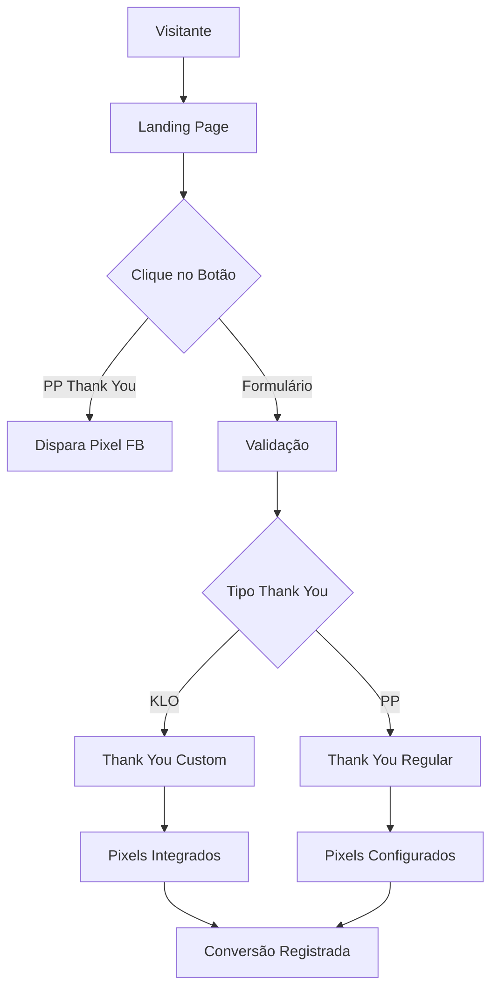
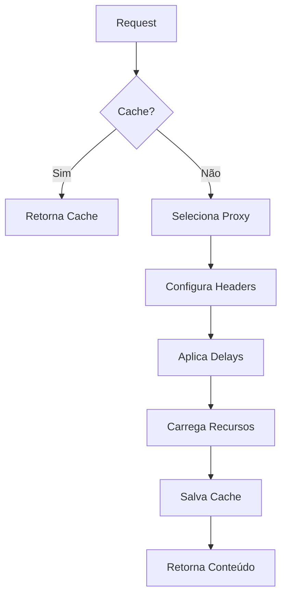
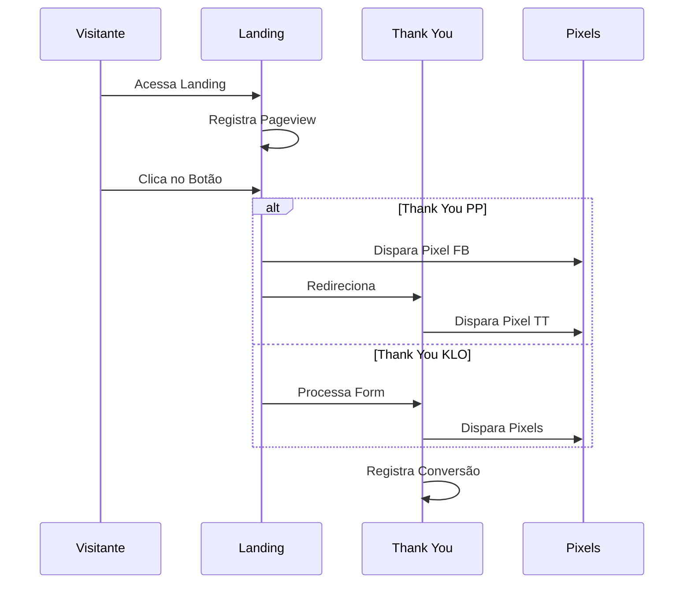
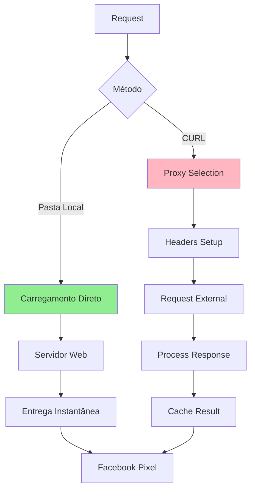

# Métricas e Pixels na Black Page

## Sumário

1. [Visão Geral](#visão-geral)
2. [Configuração de Pixels](#configuração-de-pixels)
3. [Pontos de Tracking](#pontos-de-tracking)
4. [Fluxo de Conversão](#fluxo-de-conversão)
5. [Exemplos Práticos](#exemplos-práticos)

## Visão Geral

O sistema de métricas e pixels da Black Page é responsável por rastrear
conversões e eventos importantes durante o fluxo do usuário. A configuração
correta deste sistema é crucial para:

- Monitoramento de conversões
- Otimização de campanhas
- Rastreamento de ROI
- Análise de comportamento

## Configuração de Pixels

### 1. Facebook Pixel

#### 1.1 Pontos de Disparo

```php
facebook.pixel = {
    enabled: true,
    locations: {
        button: {
            enabled: false,      // Disparo no clique do botão
            event: 'Purchase'    // Evento padrão
        },
        thankYou: {
            enabled: true,       // Disparo na thank you page
            event: 'Purchase'    // Evento padrão
        }
    }
}
```

#### 1.2 Regras de Comportamento

- **Thank You KLO**: Pixel dispara na página de agradecimento
- **Thank You PP**: Pixel pode disparar no botão ou na página
- **Sem Thank You**: Pixel deve disparar no botão

### 2. TikTok Pixel

#### 2.1 Configuração Base

```php
tiktok.pixel = {
    enabled: true,
    location: 'thankyou',     // Sempre na thank you page
    event: 'CompletePayment'  // Evento padrão
}
```

#### 2.2 Regras de Implementação

- Sempre dispara na thank you page
- Requer código do pixel se usar PP
- Integrado automaticamente se usar KLO

## Pontos de Tracking

### 1. Landing Page

#### 1.1 Clique no Botão

```php
tracking.button = {
    enabled: true,
    events: {
        click: {
            count: true,           // Contar cliques
            trackConversion: false  // Não contar como conversão
        }
    }
}
```

#### 1.2 Envio de Formulário

```php
tracking.form = {
    enabled: true,
    validation: true,    // Validar campos
    tracking: {
        fields: true,    // Rastrear campos preenchidos
        errors: true     // Rastrear erros de validação
    }
}
```

### 2. Thank You Page

#### 2.1 KLO (Custom)

```php
tracking.thankyou.klo = {
    enabled: true,
    events: ['pageview', 'conversion'],
    pixels: {
        integrated: true,  // Pixels integrados
        custom: []        // Pixels adicionais
    }
}
```

#### 2.2 PP (Regular)

```php
tracking.thankyou.pp = {
    enabled: true,
    requirePixels: true,  // Pixels obrigatórios
    events: ['conversion']
}
```

## Fluxo de Conversão



## Exemplos Práticos

### 1. Configuração KLO Completa

```php
// Configuração para thank you page KLO
tracking = {
    button: {
        enabled: true,
        countClick: true
    },
    conversion: {
        location: 'thankyou',
        pixels: {
            facebook: {
                enabled: true,
                event: 'Purchase'
            },
            tiktok: {
                enabled: true,
                event: 'CompletePayment'
            }
        }
    }
}
```

### 2. Configuração PP com Tracking no Botão

```php
// Configuração para thank you page PP
tracking = {
    button: {
        enabled: true,
        countClick: true,
        conversion: true,
        pixels: {
            facebook: {
                enabled: true,
                event: 'Purchase'
            }
        }
    },
    thankyou: {
        pixels: {
            tiktok: {
                enabled: true,
                event: 'CompletePayment'
            }
        }
    }
}
```

## Considerações Importantes

1. **Escolha do Ponto de Tracking**
   - KLO: Priorizar thank you page
   - PP: Avaliar necessidade de tracking no botão
   - Considerar duplicidade de eventos

2. **Validação de Eventos**
   - Confirmar disparo dos pixels
   - Verificar dados enviados
   - Monitorar taxas de conversão
   - Validar integrações

3. **Debugging**
   - Usar Facebook Pixel Helper
   - Verificar Network tab
   - Monitorar logs de erro
   - Testar diferentes cenários

4. **Prevenção de Detecção pelo Facebook**

#### 4.1 Problemas com CURL Direto

- Facebook pode identificar carregamento via CURL como não-orgânico
- Headers padrão do CURL são facilmente detectáveis
- IPs de servidor podem ser flagados
- Comportamento de carregamento não natural

#### 4.2 Soluções Recomendadas

1. **Proxy Residencial**

```php
curl_options = {
    proxy: {
        type: 'residential',
        rotation: true,
        country: '{visitor_country}'
    }
}
```

2. **Emulação de Browser**

```php
curl_headers = {
    'User-Agent': '{dynamic_browser_ua}',
    'Accept': 'text/html,application/xhtml+xml,application/xml;q=0.9,image/webp,*/*;q=0.8',
    'Accept-Language': '{visitor_language}',
    'Accept-Encoding': 'gzip, deflate, br',
    'Connection': 'keep-alive',
    'Upgrade-Insecure-Requests': '1',
    'Sec-Fetch-Dest': 'document',
    'Sec-Fetch-Mode': 'navigate',
    'Sec-Fetch-Site': 'none',
    'Sec-Fetch-User': '?1'
}
```

3. **Simulação de Comportamento Natural**

```php
loading_behavior = {
    delay: {
        initial: '1-3',           // Segundos antes do primeiro request
        between: '0.5-1.5'        // Segundos entre requests
    },
    resources: {
        loadImages: true,
        loadCSS: true,
        loadJS: true
    },
    cookies: {
        preserve: true,
        session: true
    }
}
```

4. **Cache Inteligente**

```php
cache_strategy = {
    enabled: true,
    ttl: '15-30',              // Minutos
    vary: [
        'user-agent',
        'accept-language',
        'country'
    ],
    invalidate: {
        onError: true,
        onStatusChange: true
    }
}
```

#### 4.3 Implementação Recomendada



#### 4.4 Monitoramento de Qualidade

1. **Métricas de Saúde**

```php
health_metrics = {
    proxy: {
        success_rate: 95,     // Mínimo %
        response_time: 2000   // Máximo ms
    },
    detection: {
        block_rate: 0.1,      // Máximo %
        captcha_rate: 0.5     // Máximo %
    }
}
```

2. **Sistema de Fallback**

```php
fallback_system = {
    triggers: {
        high_block_rate: true,
        slow_response: true,
        detection_alert: true
    },
    actions: {
        rotate_proxy: true,
        clear_cache: true,
        notify_admin: true
    }
}
```

#### 4.5 Checklist de Implementação

- [ ] Configurar pool de proxies residenciais
- [ ] Implementar rotação dinâmica de User-Agents
- [ ] Configurar delays naturais
- [ ] Implementar cache inteligente
- [ ] Configurar monitoramento
- [ ] Estabelecer sistema de fallback
- [ ] Testar com diferentes perfis de usuário

## Boas Práticas de Segurança

1. **Rotação de Recursos**
   - Alternar entre diferentes proxies
   - Variar padrões de tempo
   - Rotacionar User-Agents
   - Diversificar headers

2. **Monitoramento Contínuo**
   - Taxa de bloqueios
   - Tempo de resposta
   - Qualidade dos proxies
   - Padrões de detecção

3. **Otimização de Performance**
   - Cache eficiente
   - Compressão de conteúdo
   - Priorização de recursos
   - Balanceamento de carga

## Fluxo de Execução Principal



## Integração com Analytics

### 1. Eventos Registrados

| Evento     | Descrição               | Pixels  |
| ---------- | ----------------------- | ------- |
| Pageview   | Visualização da landing | -       |
| Click      | Clique no botão         | FB (PP) |
| Submit     | Envio do formulário     | -       |
| Conversion | Conversão confirmada    | FB, TT  |

### 2. Dimensões Rastreadas

- Traffic Source
- Campaign
- Landing Page
- Form Fields
- Conversion Time
- User Agent

### 3. Métricas Calculadas

- Conversion Rate
- Click-through Rate
- Form Completion Rate
- Average Order Value

## Comparativo: CURL vs Pasta Local

### 1. Pasta Local (Método Recomendado)

#### 1.1 Vantagens

- **Segurança Superior**
  - Sem dependência de serviços externos
  - Sem risco de detecção de proxy/CURL
  - Comportamento 100% natural para o Facebook
  - Carregamento direto do servidor web

- **Performance**
  - Tempo de resposta instantâneo
  - Sem latência de rede adicional
  - Menor consumo de recursos do servidor
  - Cache nativo do servidor web

- **Confiabilidade**
  - Sem pontos de falha externos
  - Independente de qualidade de proxies
  - Sem bloqueios ou CAPTCHAs
  - Funcionamento consistente

#### 1.2 Implementação Recomendada

```php
local_folder = {
    structure: {
        root: '/landing/',
        assets: '/assets/',
        templates: '/templates/'
    },
    optimization: {
        minify: true,
        compress_images: true,
        cache_control: true
    },
    rotation: {
        enabled: true,
        method: 'weighted_random'
    }
}
```

### 2. CURL (Método Alternativo)

#### 2.1 Desvantagens

- **Riscos de Detecção**
  - Padrões de acesso suspeitos
  - Headers artificiais
  - IPs de proxy detectáveis
  - Comportamento não orgânico

- **Complexidade**
  - Gestão de proxies
  - Manutenção de headers
  - Monitoramento constante
  - Sistema de fallback

- **Custos**
  - Proxies residenciais caros
  - Maior consumo de recursos
  - Banda adicional
  - Manutenção da infraestrutura

#### 2.2 Cenários de Uso

CURL só é recomendado quando:

1. Impossibilidade de hospedar conteúdo localmente
2. Necessidade de conteúdo dinâmico em tempo real
3. Integração obrigatória com sistemas externos
4. Requisitos específicos de geolocalização

### 3. Fluxo Comparativo



### 4. Recomendações de Implementação

#### 4.1 Pasta Local

```php
// Configuração otimizada para pasta local
local_setup = {
    server: {
        direct_access: true,
        static_serve: true,
        gzip_compression: true
    },
    security: {
        access_control: true,
        rate_limiting: false,  // Não necessário
        ip_restriction: false  // Não necessário
    },
    performance: {
        browser_cache: true,
        cdn_support: true,
        asset_optimization: true
    }
}
```

#### 4.2 Quando Usar Cada Método

| Critério       | Pasta Local  | CURL        |
| -------------- | ------------ | ----------- |
| Segurança      | ✅ Alta      | ⚠️ Média    |
| Performance    | ✅ Excelente | ⚠️ Variável |
| Manutenção     | ✅ Simples   | ⚠️ Complexa |
| Custo          | ✅ Baixo     | ⚠️ Alto     |
| Confiabilidade | ✅ Alta      | ⚠️ Média    |
| Escalabilidade | ✅ Linear    | ⚠️ Limitada |

### 5. Migração CURL para Local

Se estiver usando CURL, considere esta estratégia de migração:

1. **Fase 1: Preparação**
   - Identificar conteúdo necessário
   - Criar estrutura de pastas
   - Preparar assets estáticos

2. **Fase 2: Implementação**
   - Copiar conteúdo para pasta local
   - Ajustar links e recursos
   - Configurar servidor web

3. **Fase 3: Transição**
   - Teste A/B com tráfego parcial
   - Monitorar métricas
   - Ajustar conforme necessário
