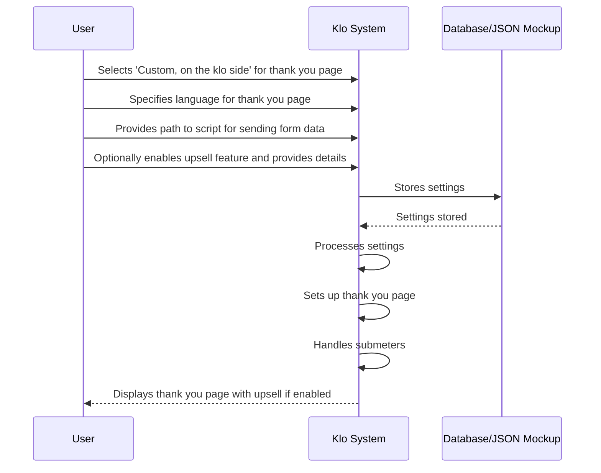

# Sequence Diagram for Klo

# Supporting Documentation

## Roles and Responsibilities

- **User**: Interacts with the settings interface to configure the thank you page setup.
- **Klo System**: Processes the user's settings, sets up the thank you page, and handles submeters.
- **Database/JSON Mockup**: Stores the settings provided by the user.

## Request and Response Content

- **User to Klo**:
  - **Selects 'Custom, on the klo side'**: This indicates the user wants to use a custom thank you page managed by Klo.
  - **Specifies language**: The language in which the thank you page should be displayed, e.g., 'EN'.
  - **Provides path to script**: The path from the root of the landing to the script that sends form data, e.g., 'order.php'.
  - **Enables upsell feature**: If enabled, the user provides details like the upsell header, text, URL, and image directory.

- **Klo to Database**:
  - **Stores settings**: The settings provided by the user are stored in the database or a JSON mockup for future reference.

- **Klo to User**:
  - **Displays thank you page**: The thank you page is displayed with the specified language and includes the upsell feature if enabled.

## Additional Context

- **Submeters**: Klo takes submeters from the URL string and either writes them into forms on local landings or appends them to links in PP. This is crucial for passing submeter values to PP and for postback tracking.
- **Upsell Feature**: If enabled, the thank you page includes an upsell section with a header, text, URL, and images from a specified directory.

This documentation covers the setup and functionality of the thank you page on the Klo side, including the handling of submeters and the optional upsell feature.
