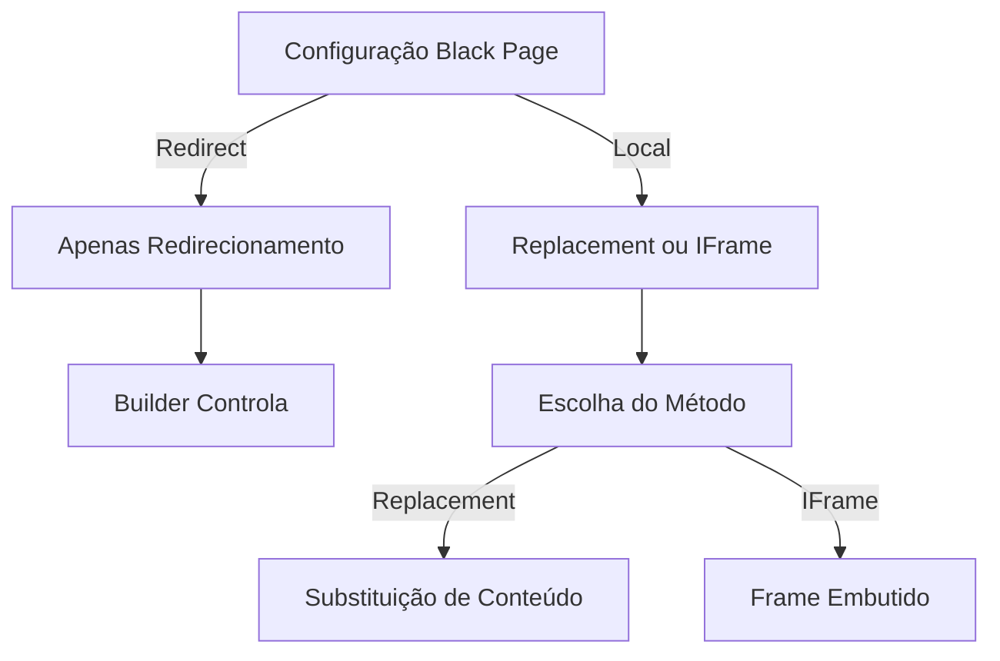
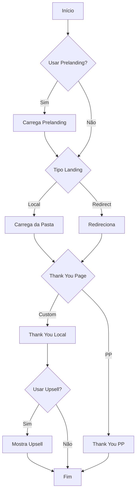

# Configuração da Black Page via Interface Administrativa

## 1. Configuração de Prelanding

### 1.1 Método de Carregamento

```php
// Configuração em settings.json:
black.prelanding.action = 'none' | 'folder'

// Interface:
[ ] Do not use prelanding
[x] Local prelanding from folder
```

### 1.2 Configuração de Pasta

```php
// Se 'folder' selecionado:
black.prelanding.folders = 'p1,p2,p3'
// Múltiplas pastas podem ser especificadas, separadas por vírgula
```

## 2. Configuração de Landing Pages

### 2.1 Método de Carregamento

```php
// Configuração em settings.json:
black.landing.action = 'folder' | 'redirect'

// Interface:
[ ] Local landing from folder
[x] Redirect
```

### 2.2 Configuração de Pasta Local

```php
// Se 'folder' selecionado:
black.landing.folder.names = 'l1,l2'
// Múltiplas pastas podem ser especificadas, separadas por vírgula
```

### 2.3 Configuração de Redirecionamento

```php
// Se 'redirect' selecionado:
black.landing.redirect.urls = 'https://yandex.ru'
black.landing.redirect.type = '301' | '302' | '303' | '307'
```

## 3. Configuração de Thank You Page

### 3.1 Tipo de Thank You Page

```php
// Configuração:
black.landing.folder.customthankyoupage.use = true | false

// Interface:
[ ] Custom, on the klo side
[x] Regular, on the PP side
```

### 3.2 Configurações da Thank You Page Personalizada

```php
// Se custom selecionado:
black.landing.folder.customthankyoupage.language = 'EN'
black.landing.folder.conversions.script = 'order.php'
```

### 3.3 Configuração de Upsell

```php
// Ativação:
black.landing.folder.customthankyoupage.upsell.use = true | false

// Configurações:
black.landing.folder.customthankyoupage.upsell.header = 'texto'
black.landing.folder.customthankyoupage.upsell.text = 'descrição'
black.landing.folder.customthankyoupage.upsell.url = 'https://upsell.com'
black.landing.folder.customthankyoupage.upsell.imgdir = 'img'
```

## 4. Configuração de JavaScript (para builders)

### 4.1 Ação de Conexão

```php
// Configuração em settings.json:
black.jsconnect = 'redirect' | 'replace' | 'iframe'

// Interface:
[ ] Redirect (Redirecionamento)
[x] Replacement (Substituição)
[ ] IFrame (Frame Embutido)

// Comportamento baseado na configuração da Black Page:
if (black.landing.action === 'redirect') {
    // Apenas redirecionamento é permitido
    // O builder controla o redirecionamento
    jsconnect = 'redirect';
} else if (black.landing.action === 'folder') {
    // Replacement e IFrame disponíveis
    jsconnect = 'replace' | 'iframe';
}
```

### 4.2 Detalhamento dos Métodos

#### 4.2.1 Redirect

- **Quando usar**: Black Page configurada como redirect
- **Comportamento**:
  - Redirecionamento controlado pelo builder
  - Usa o código HTTP configurado (301, 302, 303, 307)
  - Mantém consistência com regras de redirecionamento
- **Limitações**:
  - Não permite manipulação do conteúdo
  - Sempre resulta em mudança de URL

#### 4.2.2 Replacement

- **Quando usar**: Black Page configurada como local
- **Comportamento**:
  - Substitui conteúdo da página atual
  - Mantém URL original
  - Permite manipulação via JavaScript
- **Vantagens**:
  - Transição suave
  - Mantém contexto do navegador
  - Permite animações e efeitos

#### 4.2.3 IFrame

- **Quando usar**: Black Page configurada como local
- **Comportamento**:
  - Carrega em frame embutido
  - Mantém contexto original
  - Isolamento de ambiente
- **Considerações**:
  - Segurança entre frames
  - Comunicação via postMessage
  - Responsividade do frame

### 4.3 Fluxo de Decisão



## 5. Configurações de Tracking

### 5.1 Conversões

```php
// Para thank you page PP:
black.landing.folder.conversions.logonbuttonclick = true | false

// Configuração de Pixels:
pixels.fb.conversion.fireonbutton = true | false  // Facebook
pixels.tt.conversion.fireonbutton = true | false  // TikTok
```

## Estrutura de Arquivos

### Prelanding

```
/prelanding/
  ├── p1/
  ├── p2/
  └── p3/
```

### Landing

```
/landing/
  ├── l1/
  └── l2/
```

### Thank You Page

```
/thankyou/
  └── upsell/
      └── img/
```

## Fluxo de Execução



## Variáveis de Sistema

### 1. Prelanding

```php
$black_preland_action        // Método de carregamento
$black_preland_folder_names  // Nomes das pastas
```

### 2. Landing

```php
$black_land_action          // Método de carregamento
$black_land_folder_names    // Nomes das pastas
$black_land_redirect_urls   // URLs de redirecionamento
$black_land_redirect_type   // Tipo de redirecionamento
```

### 3. Thank You Page

```php
$black_land_use_custom_thankyou_page  // Usar página personalizada
$black_land_thankyou_page_language    // Idioma
$black_land_conversion_script         // Script de conversão
```

### 4. Upsell

```php
$thankyou_upsell          // Ativar upsell
$thankyou_upsell_header   // Cabeçalho
$thankyou_upsell_text     // Texto
$thankyou_upsell_url      // URL
$thankyou_upsell_imgdir   // Diretório de imagens
```

## Considerações Importantes

1. **Prelanding**
   - Pode ser desativado completamente
   - Suporta múltiplas pastas para rotação
   - Carregamento apenas local

2. **Landing**
   - Dois métodos de entrega
   - Suporte a múltiplas pastas/URLs
   - Códigos de redirecionamento configuráveis

3. **Thank You Page**
   - Duas opções: Custom ou PP
   - Suporte a upsell na versão custom
   - Configuração de idioma personalizada

4. **JavaScript**
   - Opções limitadas por tipo de landing
   - Integração com builders
   - Comportamento específico por método
