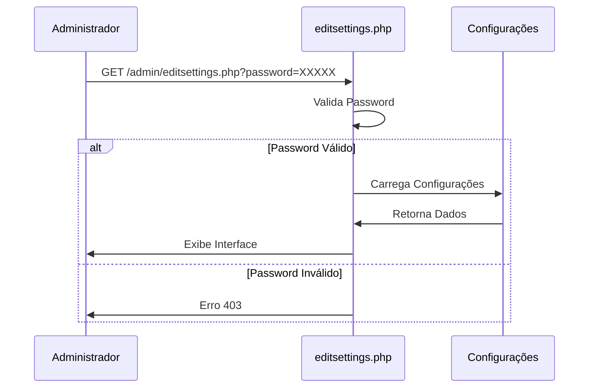
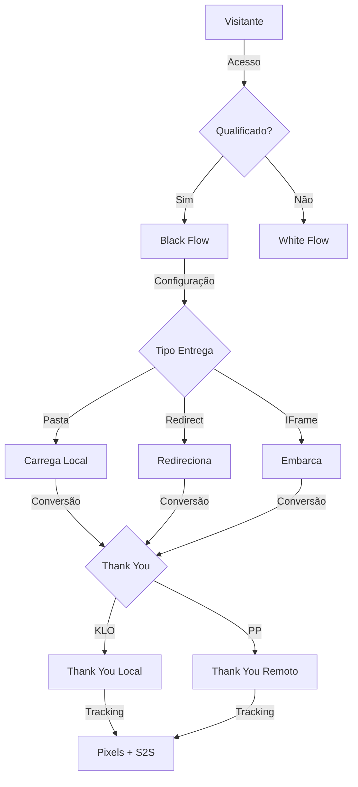
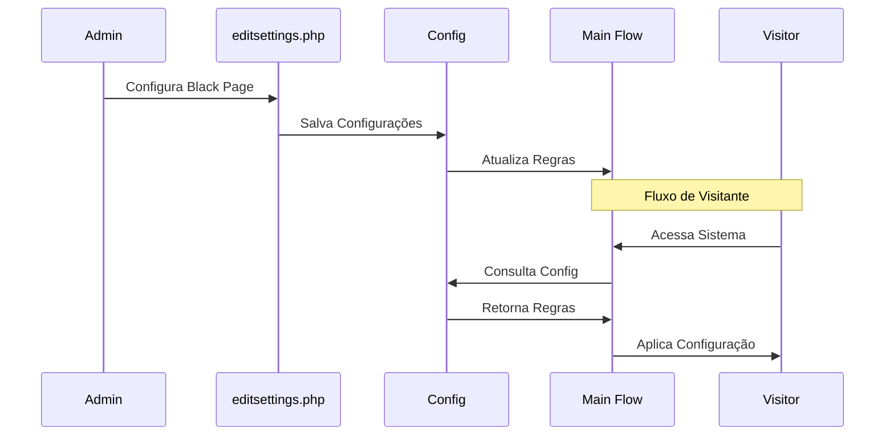

# Interface Administrativa da Black Page

## Sumário

1. [Visão Geral](#visão-geral)
2. [Acesso à Interface](#acesso-à-interface)
3. [Estrutura da Interface](#estrutura-da-interface)
4. [Configurações Disponíveis](#configurações-disponíveis)
5. [Fluxo de Execução](#fluxo-de-execução)
6. [Exemplos Práticos](#exemplos-práticos)
7. [Considerações de Segurança](#considerações-de-segurança)
8. [Boas Práticas](#boas-práticas)

## Visão Geral

A interface administrativa da Black Page (`editsettings.php`) é o ponto central
de configuração para o tráfego monetizado do sistema. Esta interface permite
configurar todos os aspectos relacionados à entrega da oferta principal aos
visitantes qualificados.

## Acesso à Interface

### Endpoint

```
http://localhost:80010/admin/editsettings.php?password=XXXXX
```

### Autenticação

- Método: GET Parameter
- Parâmetro: `password`
- Localização: Query String
- Tipo: String (MD5 hash no backend)



## Estrutura da Interface

### Seções Principais

1. **Configurações de Entrega**
```json
{
    "black": {
        "action": "string",
        "url": "string",
        "method": "string",
        "params": {
            "custom": "boolean",
            "tracking": "boolean"
        }
    }
}
```

2. **Parâmetros de Tracking**
```json
{
    "tracking": {
        "enabled": "boolean",
        "pixels": ["string"],
        "postback": {
            "url": "string",
            "events": ["string"]
        }
    }
}
```

3. **Otimização de Conversão**
```json
{
    "optimization": {
        "split_test": "boolean",
        "variants": ["string"],
        "weights": ["number"]
    }
}
```

## Glossário de Termos

- **KLO (Keitaro Landing Optimization)**: Sistema de otimização de landing pages
- **PP (Payment Provider/Partner Program)**: Provedor de pagamento ou programa
de afiliados
- **Black Page**: Página de oferta monetizada
- **White Page**: Página de conteúdo para visitantes não qualificados
- **S2S (Server-to-Server)**: Comunicação entre servidores para tracking
- **Prelanding**: Página intermediária antes da oferta principal
- **Postback**: Notificação de evento de conversão

## Configurações Disponíveis

### 1. Método de Entrega

#### Comparativo de Métodos

| Método           | Vantagens                                                                | Desvantagens                                                                           | Uso Recomendado    |
| ---------------- | ------------------------------------------------------------------------ | -------------------------------------------------------------------------------------- | ------------------ |
| Pasta Local      | - Carregamento rápido<br>- Controle total<br>- Sem dependências externas | - Ocupa espaço<br>- Atualização manual<br>- Limitado ao servidor                       | Ofertas estáticas  |
| Redirecionamento | - Sem espaço local<br>- Atualização automática<br>- Flexível             | - Dependência externa<br>- Latência de rede<br>- Exposição de URL                      | Ofertas dinâmicas  |
| IFrame           | - Isolamento<br>- Contexto preservado<br>- Fácil integração              | - Limitações de segurança<br>- Problemas de responsividade<br>- Restrições de browsers | Ofertas embarcadas |

#### 1.1 Pasta Local (Folder)

```php
black.action = 'folder'
black.folder = {
    path: '/landing/offers/',
    rotation: true,
    names: ['offer1', 'offer2']
}
```

#### 1.2 Redirecionamento (Redirect)

```php
black.action = 'redirect'
black.redirect = {
    type: '302',  // 301, 302, 303, 307
    urls: ['https://offer1.com', 'https://offer2.com'],
    rotation: true
}
```

### 2. Configuração de Tracking

#### 2.1 Pixels de Conversão

```php
tracking.pixels = {
    facebook: {
        enabled: true,
        event: 'Purchase',
        fireonbutton: true
    },
    tiktok: {
        enabled: true,
        event: 'CompletePayment',
        fireonbutton: true
    }
}
```

#### 2.2 Postback S2S

```php
tracking.s2s = {
    url: 'https://tracker.com/postback',
    events: ['lead', 'sale', 'conversion'],
    parameters: {
        clickid: '{click_id}',
        payout: '{payout}'
    }
}
```

### 3. Integração KLO-PP 

#### 3.1 Configuração da Thank You Page

A configuração da Thank You Page envolve duas abordagens principais:

1. **Custom (KLO Side)**
- Thank you page hospedada no próprio KLO
- Permite personalização completa
- Suporta upsell
- Requer configuração de script de processamento
```php
black.thankyou = {
    type: 'klo',
    language: 'RU',           // Idioma da página
    script: 'order.php',      // Script para processar dados
    upsell: {
        enabled: true,
        // configurações de upsell
    }
}
```

2. **Regular (PP Side)** 
- O PP refere-se a Payment Provider ou Partner Program.
- Thank you page no lado do Programa de Afiliados
- Gerenciada pelo provedor de pagamento
- Tracking integrado com PP
- Requer configuração de pixels
```php
black.thankyou = {
    type: 'pp',
    pixels: {
        required: true,
        // códigos dos pixels
    }
}
```

#### 3.2 Configuração de Conversões

##### 3.2.1 Contagem de Conversões na Landing Page

```php
black.conversions = {
    buttonClick: {
        enabled: false,  // true se usar PP, false se usar Custom
        tracking: {
            facebook: {
                onButton: false,  // true para tracking no botão
                onThankYou: true  // true para tracking na thank you
            },
            tiktok: {
                onThankYou: true  // apenas na thank you page
            }
        }
    }
}
```

**Comportamento:**

- Com Thank You **Custom (KLO)**:
- Conversão contada na thank you page
- Não necessita tracking no botão
- Pixels integrados na página personalizada

- Com Thank You **Regular (PP)**:
- Pode contar conversão no clique do botão
- Requer configuração de pixels
- Tracking na thank you page do PP

##### 3.2.2 Configuração de Pixels

1. **Facebook Pixel**
```php
pixels.facebook = {
    location: 'thankyou',     // ou 'button'
    customThankYou: false,    // true se usar KLO
    code: 'PIXEL_CODE_HERE'   // obrigatório se usar PP
}
```

2. **TikTok Pixel**
```php
pixels.tiktok = {
    location: 'thankyou',     // sempre na thank you
    customThankYou: false,    // true se usar KLO
    code: 'PIXEL_CODE_HERE'   // obrigatório se usar PP
}
```

#### 3.3 Integração com Builders (JavaScript)

```php
black.jsconnect = {
    method: 'redirect' | 'replacement' | 'iframe',
    conditions: {
        blackIsRedirect: {
            allowedMethods: ['redirect']
        },
        blackIsLocal: {
            allowedMethods: ['replacement', 'iframe']
        }
    }
}
```

**Regras de Comportamento:**

1. Se Black Page está configurada como redirect:
- Apenas método 'redirect' é permitido
- Builder controla o redirecionamento

2. Se Black Page é local:
- Disponível 'replacement' ou 'iframe'
- Não permite redirecionamento

## Fluxo de Execução Detalhado



## Considerações de Implementação

1. **Escolha do Método**
- **Pasta Local**: Ideal para ofertas estáticas e controle total
- **Redirecionamento**: Melhor para ofertas dinâmicas e atualizações
    frequentes
- **IFrame**: Útil para integrações que precisam manter contexto

2. **Tracking**
- Configurar pixels antes do redirecionamento
- Implementar S2S como backup
- Validar eventos de conversão
- Monitorar logs de postback

3. **Thank You Page**
- KLO: Maior controle e personalização
- PP: Integração direta com afiliado
- Considerar upsell quando apropriado

## Exemplos Práticos

### Exemplo 1: Configuração Básica

```php
// Configuração de redirecionamento simples
black.action = 'redirect'
black.redirect.url = 'https://oferta.com'
black.tracking.enabled = true
```

### Exemplo 2: Configuração Avançada com Parâmetros

```php
// Configuração com parâmetros dinâmicos
black.action = 'redirect'
black.redirect.url = 'https://oferta.com'
black.params.enabled = true
black.params.list = [
    {name: "source", value: "{traffic_source}"},
    {name: "click_id", value: "{click_id}"}
]
black.tracking.pixels = [
    "https://tracker1.com?event=conversion",
    "https://tracker2.com?event=lead"
]
```

## Considerações de Segurança

### 1. Proteção de Acesso

- Implementação de rate limiting
- Logging de tentativas de acesso
- Rotação periódica de senha
- Bloqueio após tentativas falhas

### 2. Validação de Dados

- Sanitização de inputs
- Validação de URLs
- Verificação de domínios permitidos
- Proteção contra XSS

### 3. Auditoria

- Log de alterações
- Histórico de configurações
- Backup automático
- Rollback de emergência

## Boas Práticas

1. **Manutenção**
- Revisar configurações periodicamente
- Manter backup das configurações
- Documentar alterações
- Testar antes de aplicar em produção

2. **Monitoramento**
- Acompanhar métricas de entrega
- Monitorar taxas de conversão
- Verificar logs de erro
- Avaliar performance

3. **Otimização**
- Realizar testes A/B
- Analisar métricas
- Ajustar parâmetros
- Implementar melhorias

## Integração com Fluxo Principal



### Estados do Sistema

1. **Configuração**
- Admin acessa interface
- Modifica parâmetros
- Salva alterações
- Sistema atualiza regras

2. **Execução**
- Visitante acessa sistema
- Sistema consulta configurações
- Aplica regras definidas
- Executa ação configurada

3. **Monitoramento**
- Sistema registra eventos
- Coleta métricas
- Atualiza estatísticas
- Gera relatórios

## Conclusão

A interface administrativa da Black Page é um componente crucial do sistema,
permitindo controle total sobre a entrega de ofertas e monetização do tráfego.
Sua correta configuração e monitoramento são essenciais para o sucesso da
operação.
