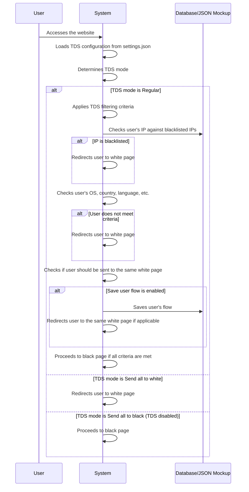

# Sequence Diagram for TDS Process

# Supporting Documentation

## Roles and Responsibilities

- **User**: Accesses the website, triggering the TDS process.
- **System**: Loads TDS configuration, applies filtering criteria, and decides whether to redirect to a white page or proceed to a black page.
- **Database/JSON Mockup**: Stores TDS configuration and user flow data.

## Request and Response Content

- **User to System**:
  - **Access**: The user accesses the website, providing their IP, user agent, and other information.

- **System to System**:
  - **Load Configuration**: Loads TDS configuration from `settings.json`.
  - **Determine TDS Mode**: Checks the TDS mode (`$tds_mode`).
  - **Apply Filtering Criteria**: Checks user's IP, OS, country, language, etc., against TDS filtering criteria.
  - **Check User Flow**: Checks if the user should be sent to the same white page (`$save_user_flow`).

- **System to Database**:
  - **Check IP**: Checks the user's IP against blacklisted IPs.
  - **Save User Flow**: Saves the user's flow if `$save_user_flow` is enabled.

- **System to User**:
  - **Redirect**: Redirects the user to a white page if any filtering criteria are met or if TDS mode is set to "Send all to white", otherwise proceeds to the black page.

## Additional Context

- **TDS Configuration**: The TDS configuration is stored in `settings.json` and includes:
  - TDS mode: Regular, Send all to white, or Send all to black (TDS disabled)
  - Save user flow: Whether to save the user's flow to ensure they are sent to the same white page
  - Filtering criteria: Allowed OS, countries, languages, and blocked IPs, user agents, etc.

- **State Changes**: The state of the TDS process changes as follows:
  - **Initial State**: User accesses the website.
  - **Configuration State**: TDS configuration is loaded.
  - **Filtering State**: User information is checked against TDS filtering criteria.
  - **Flow State**: User flow is checked and saved if applicable.
  - **Final State**: User is either redirected to a white page or proceeds to a black page.

This documentation covers the TDS process, starting from the user accessing the website, and details the roles, data flow, and state changes involved in the process.
