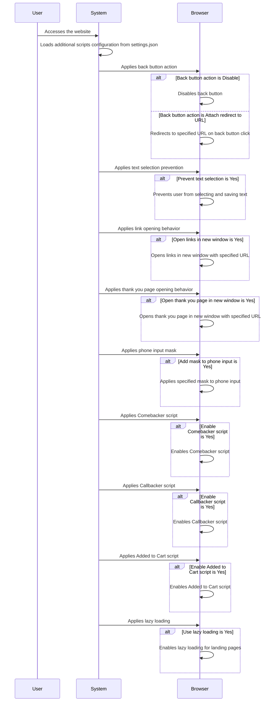

# Sequence Diagram for Additional Scripts Process

# Supporting Documentation

## Roles and Responsibilities

- **User**: Accesses the website, triggering the additional scripts process.
- **System**: Loads additional scripts configuration, applies settings to the browser.
- **Browser**: Executes the scripts and applies the configured behaviors.

## Request and Response Content

- **User to System**:
  - **Access**: The user accesses the website, triggering the additional scripts process.

- **System to System**:
  - **Load Configuration**: Loads additional scripts configuration from `settings.json`.

- **System to Browser**:
  - **Apply Back Button Action**: Applies the configured back button action (disable or redirect).
  - **Apply Text Selection Prevention**: Applies the configured text selection prevention.
  - **Apply Link Opening Behavior**: Applies the configured link opening behavior.
  - **Apply Thank You Page Opening Behavior**: Applies the configured thank you page opening behavior.
  - **Apply Phone Input Mask**: Applies the configured phone input mask.
  - **Apply Comebacker Script**: Applies the configured Comebacker script.
  - **Apply Callbacker Script**: Applies the configured Callbacker script.
  - **Apply Added to Cart Script**: Applies the configured Added to Cart script.
  - **Apply Lazy Loading**: Applies the configured lazy loading for landing pages.

## Additional Context

- **Additional Scripts Configuration**: The additional scripts configuration is stored in `settings.json` and includes:
  - Back button action: Leave default, Disable, or Attach redirect to URL
  - Back button redirect URL: URL to redirect to when back button is clicked
  - Prevent text selection: No or Yes
  - Open links in new window: No or Yes
  - URL that will open in old window: URL to open in old window
  - Open thank you page in new window: No or Yes
  - URL that will open in old window: URL to open in old window
  - Add mask to phone input: No or Yes
  - Phone input mask: Format of the mask
  - Enable Comebacker script: No or Yes
  - Enable Callbacker script: No or Yes
  - Enable Added to Cart script: No or Yes
  - Use lazy loading: No or Yes

- **State Changes**: The state of the additional scripts process changes as follows:
  - **Initial State**: User accesses the website.
  - **Configuration State**: Additional scripts configuration is loaded.
  - **Execution State**: Browser executes the configured scripts and applies the behaviors.
  - **Final State**: The website is displayed with the additional scripts applied.

This documentation covers the additional scripts process, starting from the user accessing the website, and details the roles, data flow, and state changes involved in the process.
