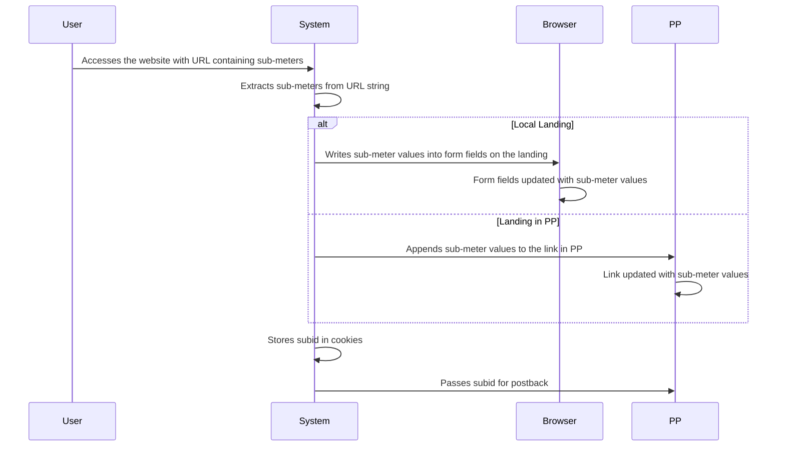

# Sequence Diagram for Sub-meters Process



# Supporting Documentation

## Roles and Responsibilities

- **User**: Accesses the website with URL containing sub-meters.
- **System**: Extracts sub-meters from the URL, writes them to form fields or appends them to links, stores subid in cookies, and passes subid for postback.
- **Browser**: Updates form fields with sub-meter values on local landings.
- **PP**: Updates links with sub-meter values and receives subid for postback.

## Request and Response Content

- **User to System**:
  - **Access**: The user accesses the website with a URL containing sub-meters.

- **System to System**:
  - **Extract Sub-meters**: Extracts sub-meters from the URL string.
  - **Store Subid**: Stores the subid in cookies.

- **System to Browser**:
  - **Write Sub-meters to Form Fields**: Writes sub-meter values into form fields on the landing.

- **System to PP**:
  - **Append Sub-meters to Link**: Appends sub-meter values to the link in PP.
  - **Pass Subid for Postback**: Passes the subid to PP for postback.

## Additional Context

### Difference between Local Landing and Landing in PP

- **Local Landing**: When a user lands on a page hosted directly by the system, the sub-meter values are written into form fields on the landing page. This is typically used for direct user interaction where the system has full control over the page content.

- **Landing in PP**: When a user is redirected to a page hosted by a third-party platform (PP), the system appends the sub-meter values to the link before redirecting. The PP then uses these values to track or modify the user's experience on their platform.

### Receiving Returns from Platforms

- **MaxBounty, ClickBank, BuyGoods**: These platforms typically send back data through postback URLs or API calls. The system receives this data and processes it to update user records or trigger further actions. For example, if a conversion occurs on ClickBank, ClickBank would send a postback to the system with details like the subid, which the system uses to record the conversion and possibly pass it to PP for further tracking or processing.

- **Sub-meters**: Sub-meters are extracted from the URL string and include:
  - **subid**: Unique identifier of the user, created when the user lands on black, stored in cookies.
  - **prelanding**: Name of the prelanding folder.
  - **landing**: Name of the landing folder.
  - Other custom tags like `cn`, `sub1`, `sub2`, `sub3`, `sub4`, etc.

- **Example**: If the URL string is `http://xxx.com?cn=MyCampaign`, and `cn` is mapped to `utm_campaign` in settings, the following will be added to the form on the landing:
  ```html
  <input type="hidden" name="utm_campaign" value="MyCampaign"/>
  ```

- **State Changes**: The state of the sub-meters process changes as follows:
  - **Initial State**: User accesses the website with URL containing sub-meters.
  - **Extraction State**: Sub-meters are extracted from the URL string.
  - **Application State**: Sub-meters are applied to form fields on local landings or appended to links in PP.
  - **Storage State**: Subid is stored in cookies.
  - **Postback State**: Subid is passed to PP for postback.
  - **Final State**: The website is displayed with sub-meters applied, and subid is ready for postback.

This documentation covers the sub-meters process, starting from the user accessing the website with sub-meters in the URL, and details the roles, data flow, and state changes involved in the process.
