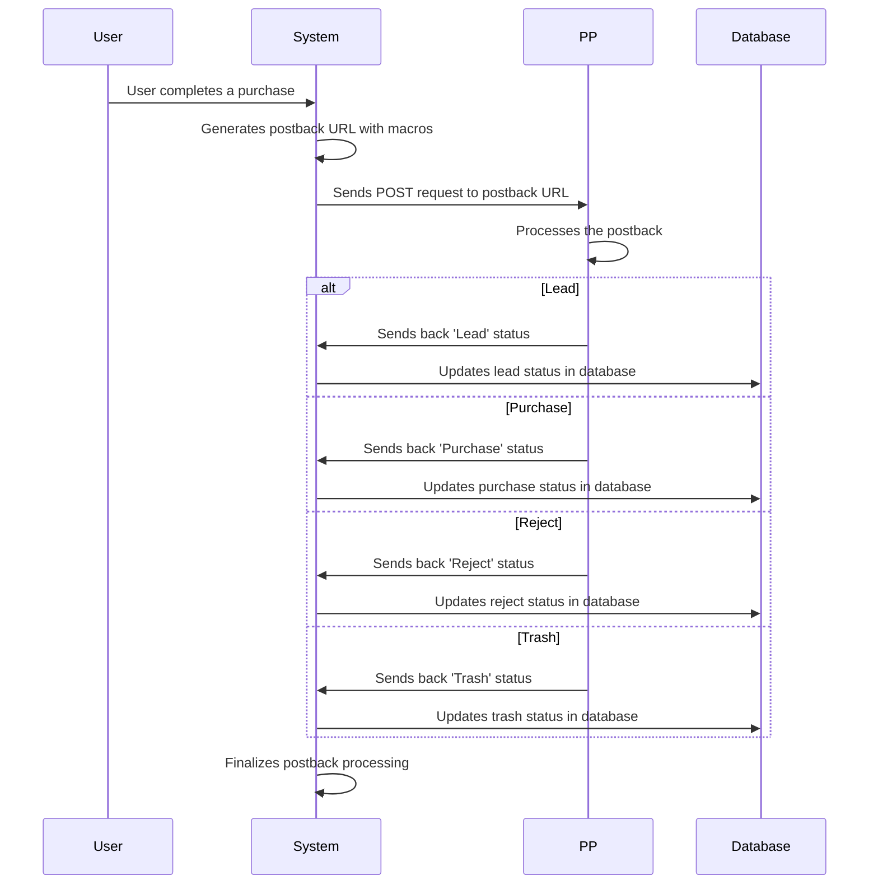

# Postbacks Documentation

## Lead Statuses

The following statuses are sent by the PP postback:

- **Lead**: Indicates a lead has been generated.
- **Purchase**: Indicates a purchase has been made.
- **Reject**: Indicates a lead or purchase has been rejected.
- **Trash**: Indicates a lead or purchase has been marked as trash.

## S2S Postback Settings

### URL

The URL for sending postbacks is:
```
https://s2s-postback.com
```

### Method of Sending Postback

The method used for sending postbacks is:
```
POST
```

### Macros Available in Postback URL

Inside the postback URL, you can use the following macros:

- `{subid}`
- `{prelanding}`
- `{landing}`
- `{px}`
- `{domain}`
- `{status}`

### Events for Which Postback Will Be Sent

Postbacks will be sent for the following events:

- **Lead**
- **Purchase**
- **Reject**
- **Trash**

## Detailed Postback Process

### Sequence Diagram for Postback Process



### State Changes During Postback Process

- **Initial State**: User completes a purchase.
- **Postback Generation State**: System generates the postback URL with macros.
- **Postback Sending State**: System sends a POST request to the postback URL.
- **Postback Processing State**: PP processes the postback and sends back a status.
- **Database Update State**: System updates the database with the received status.
- **Final State**: Postback processing is finalized.

### Roles and Responsibilities

- **User**: Completes a purchase or action that triggers a postback.
- **System**: Generates and sends the postback URL, processes the returned status, and updates the database.
- **PP**: Receives the postback, processes it, and sends back a status.
- **Database**: Stores the updated status of the postback.

### Request and Response Content

- **User to System**:
  - **Purchase**: User completes a purchase, triggering the postback process.

- **System to PP**:
  - **Postback URL**: System sends a POST request to `https://s2s-postback.com` with macros like `{subid}`, `{prelanding}`, `{landing}`, `{px}`, `{domain}`, `{status}`.

- **PP to System**:
  - **Status**: PP sends back a status like 'Lead', 'Purchase', 'Reject', or 'Trash'.

- **System to Database**:
  - **Update Status**: System updates the database with the received status.

### Integration Examples

#### ClickBank

- **Postback URL**: `https://s2s-postback.com?subid={subid}&status={status}`
- **Example**: If a user makes a purchase on ClickBank, ClickBank sends a POST request to the postback URL with the `subid` and `status` set to 'Purchase'. The system then updates the database with this information.

#### BuyGoods

- **Postback URL**: `https://s2s-postback.com?subid={subid}&status={status}`
- **Example**: If a user makes a purchase on BuyGoods, BuyGoods sends a POST request to the postback URL with the `subid` and `status` set to 'Purchase'. The system then updates the database with this information.

This documentation outlines the settings and configurations for handling postbacks in the system, including detailed examples of integration with ClickBank and BuyGoods.
