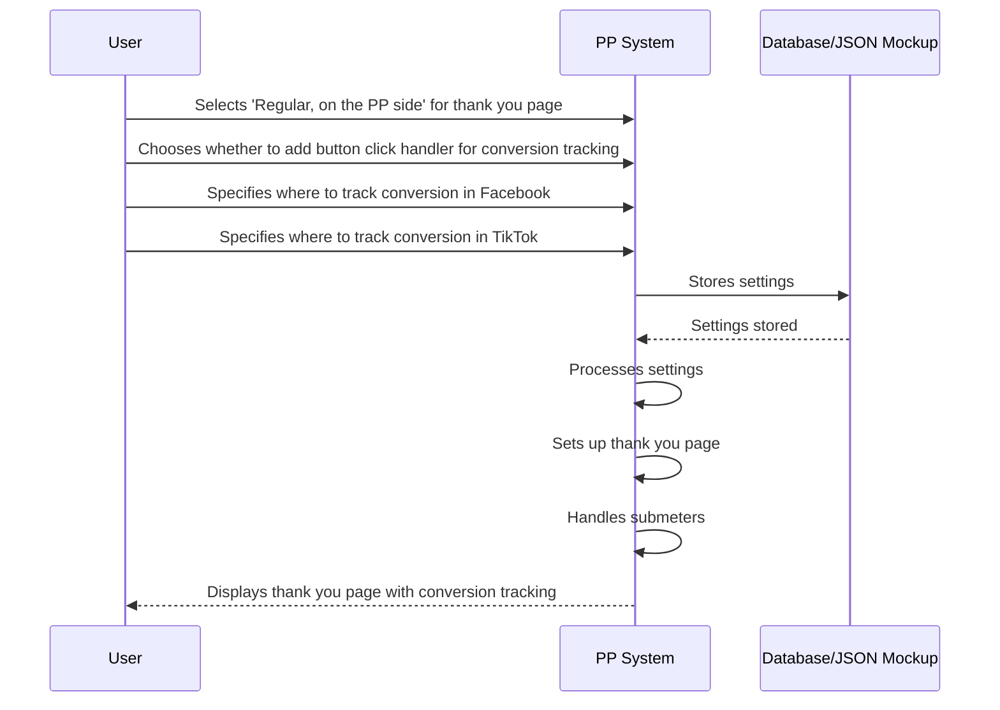

# Sequence Diagram for PP

# Supporting Documentation

## Roles and Responsibilities

- **User**: Interacts with the settings interface to configure the thank you page setup on the PP side.
- **PP System**: Processes the user's settings, sets up the thank you page, and handles submeters.
- **Database/JSON Mockup**: Stores the settings provided by the user.

## Request and Response Content

- **User to PP**:
  - **Selects 'Regular, on the PP side'**: This indicates the user wants to use a regular thank you page managed by PP.
  - **Chooses button click handler**: The user decides whether to add a button click handler to count conversions on the landing page.
  - **Specifies conversion tracking for Facebook**: The user chooses where to track conversions in Facebook, either from the thank you page or from a button on the landing page.
  - **Specifies conversion tracking for TikTok**: The user chooses where to track conversions in TikTok, either from the thank you page.

- **PP to Database**:
  - **Stores settings**: The settings provided by the user are stored in the database or a JSON mockup for future reference.

- **PP to User**:
  - **Displays thank you page**: The thank you page is displayed with the specified conversion tracking options.

## Additional Context

- **Submeters**: PP takes submeters from the URL string and either writes them into forms on local landings or appends them to links in PP. This is crucial for passing submeter values to PP and for postback tracking.
- **Conversion Tracking**: 
  - **On the PP Side**: Conversions are tracked based on the user's settings. If the user chooses to add a button click handler, conversions are counted on the landing page. Otherwise, conversions are tracked from the thank you page. For Facebook and TikTok, conversions can be tracked from the thank you page or from a button on the landing page, depending on the user's choice.

## Detailed Documentation on Conversion Registration

### PP Side

- **Button Click Handler**: If enabled, the PP system adds a JavaScript event listener to the conversion button on the landing page. When the button is clicked, the event listener sends a request to the PP server to log the conversion. The conversion data is then stored in the database or JSON mockup.

- **Thank You Page**: If the user chooses to track conversions from the thank you page, the PP system includes tracking pixels for Facebook and TikTok on the thank you page. When the thank you page loads, these pixels fire and send conversion data to the respective platforms. The conversion data is also logged in the PP system's database or JSON mockup.

- **Facebook Conversion Tracking**: 
  - **From Thank You Page**: The thank you page includes the Facebook pixel code. When the page loads, the pixel fires and sends conversion data to Facebook.
  - **From Button on Landing**: If chosen, a button on the landing page triggers the Facebook pixel when clicked, sending conversion data to Facebook.

- **TikTok Conversion Tracking**: 
  - **From Thank You Page**: The thank you page includes the TikTok pixel code. When the page loads, the pixel fires and sends conversion data to TikTok.
  - **From Button on Landing**: If chosen, a button on the landing page triggers the TikTok pixel when clicked, sending conversion data to TikTok.

### Klo Side

- **Thank You Page**: On the Klo side, conversions are tracked exclusively from the thank you page. The thank you page includes tracking pixels for Facebook and TikTok. When the thank you page loads, these pixels fire and send conversion data to the respective platforms. The conversion data is also logged in the Klo system's database or JSON mockup.

- **Facebook Conversion Tracking**: The thank you page includes the Facebook pixel code. When the page loads, the pixel fires and sends conversion data to Facebook.

- **TikTok Conversion Tracking**: The thank you page includes the TikTok pixel code. When the page loads, the pixel fires and sends conversion data to TikTok.

This documentation covers the setup and functionality of the thank you page on the PP side, including conversion tracking options and detailed explanations of how conversions are registered in both PP and Klo cases.
