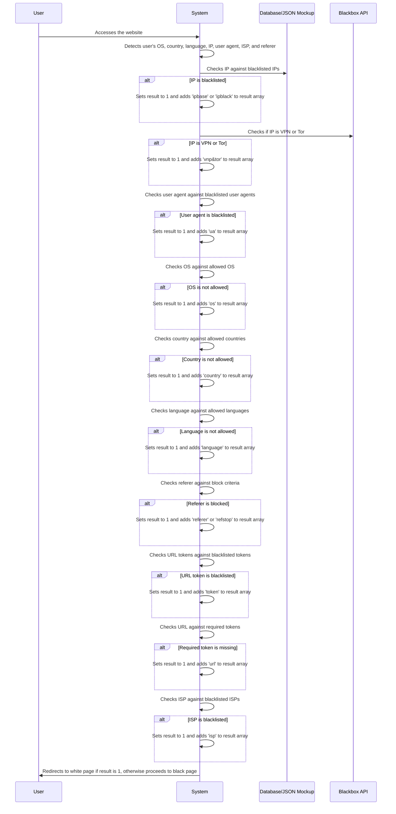

# Sequence Diagram for Filtering Process

# Supporting Documentation

## Roles and Responsibilities

- **User**: Accesses the website, triggering the filtering process.
- **System**: Detects user information, checks against filtering criteria, and decides whether to redirect to a white page or proceed to a black page.
- **Database/JSON Mockup**: Stores blacklisted IPs and other filtering criteria.
- **Blackbox API**: Provides information on whether the user's IP is associated with VPN or Tor.

## Request and Response Content

- **User to System**:
  - **Access**: The user accesses the website, providing their IP, user agent, and other information.

- **System to System**:
  - **Detection**: Collects user's OS, country, language, IP, user agent, ISP, and referer.
  - **IP Check**: Checks the user's IP against blacklisted IPs stored in the database.
  - **VPN/Tor Check**: Queries the Blackbox API to check if the IP is associated with VPN or Tor.
  - **User Agent Check**: Checks the user agent against blacklisted user agents.
  - **OS Check**: Checks the user's OS against allowed OS.
  - **Country Check**: Checks the user's country against allowed countries.
  - **Language Check**: Checks the user's language against allowed languages.
  - **Referer Check**: Checks the referer against block criteria.
  - **URL Token Check**: Checks the URL against blacklisted tokens.
  - **Required Token Check**: Checks the URL against required tokens.
  - **ISP Check**: Checks the user's ISP against blacklisted ISPs.

- **System to User**:
  - **Redirect**: Redirects the user to a white page if any filtering criteria are met (result is 1), otherwise proceeds to the black page.

## Additional Context

- **Filtering Criteria**: The filtering criteria are defined in the `Cloaker` class constructor and include:
  - Allowed OS: Android, iOS, Windows, OS X
  - Allowed countries: RU, UA (or WW for all)
  - Allowed languages: en, ru, de (or any for all)
  - Blacklisted IP file: `blackbase.txt` in the `bases` folder
  - Blacklisted IP in CIDR format: Optional
  - URL tokens to check: `key=2`
  - Blacklisted user agents: facebook, Facebot, curl, gce-spider, yandex.com/bots, OdklBot
  - Blacklisted ISPs: facebook, google, yandex, amazon, azure, digitalocean, microsoft
  - Block requests without referer: Optional
  - Referer stopwords: adheart
  - Block VPN and Tor: Optional

- **State Changes**: The state of the filtering process changes as follows:
  - **Initial State**: User accesses the website.
  - **Detection State**: User information is collected.
  - **Checking State**: User information is checked against filtering criteria.
  - **Final State**: User is either redirected to a white page or proceeds to a black page.

This documentation covers the filtering process, starting from the user accessing the website, and details the roles, data flow, and state changes involved in the process.
