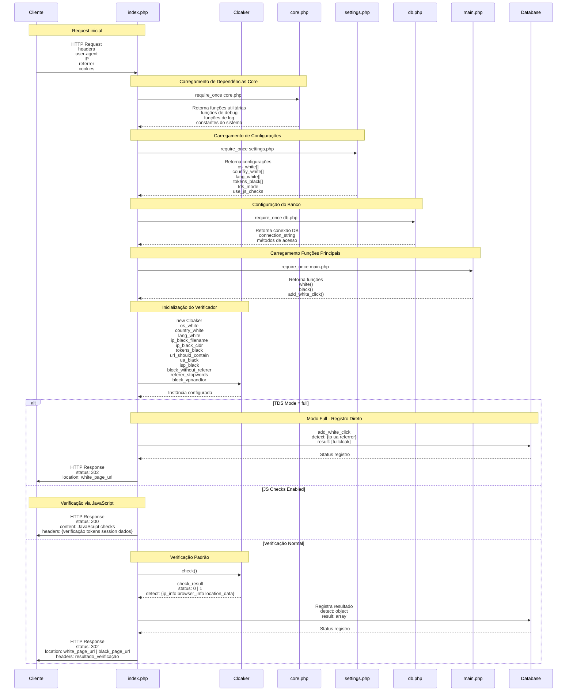

# Detalhamento dos Fluxos de Verificação

## 1. Modo Full - Registro Direto (TDS Mode = full)

Este modo representa um redirecionamento direto e completo, onde:

- **Objetivo**: Redirecionar todos os usuários para a white page sem
  verificações adicionais
- **Processo**:
  1. Sistema recebe a requisição inicial
  2. Identifica que está em modo full (tds_mode='full')
  3. Registra o acesso no banco de dados com:
     - Informações de detecção (detect):
       - IP do visitante
       - User Agent do navegador
       - Referrer (origem do acesso)
     - Resultado marcado como ['fullcloak']
  4. Realiza redirecionamento 302 para white_page_url
- **Uso**: Útil para períodos onde se deseja total proteção ou manutenção

## 2. Verificação via JavaScript (JS Checks Enabled)

Este modo utiliza verificações do lado do cliente para maior segurança:

- **Objetivo**: Realizar verificações adicionais usando JavaScript antes de
  decidir o redirecionamento
- **Processo**:
  1. Sistema identifica que JS checks estão habilitados (use_js_checks=true)
  2. Retorna uma página HTML com:
     - Status 200 (OK)
     - Scripts de verificação JavaScript embutidos
     - Headers especiais contendo:
       - Tokens de verificação
       - Dados de sessão
       - Parâmetros de validação
  3. O JavaScript do cliente executa verificações como:
     - Detecção de automação
     - Verificação de comportamento do usuário
     - Análise de características do navegador
- **Uso**: Fornece uma camada adicional de segurança contra bots e automações

## 3. Verificação Padrão (Normal Check)

Este é o fluxo padrão de verificação completa:

- **Objetivo**: Realizar uma análise completa do visitante para determinar se é
  um usuário legítimo ou bot/moderador
- **Processo**:
  1. Chamada ao método check() do Cloaker que analisa:
     - Informações do IP:
       - Localização geográfica
       - Provedor de internet
       - Verificação de VPN/Proxy
     - Dados do navegador:
       - Sistema operacional
       - Linguagem
       - Características do user agent
     - Dados de localização e comportamento
  2. Retorno do check_result com:
     - Status:
       - 0 = Usuário normal
       - 1 = Bot/Moderador detectado
     - Dados completos da detecção
  3. Registro do resultado no banco de dados:
     - Objeto de detecção completo
     - Array de resultados das verificações
  4. Redirecionamento final:
     - Para white_page_url se bot/moderador detectado
     - Para black_page_url se usuário normal
     - Headers incluindo resultado da verificação

- **Uso**: É o modo mais completo de verificação, combinando múltiplas técnicas
  de detecção

## Comparação dos Modos

| Característica   | Modo Full | JS Checks | Verificação Padrão |
| ---------------- | --------- | --------- | ------------------ |
| Velocidade       | Rápida    | Média     | Completa           |
| Precisão         | Baixa     | Alta      | Muito Alta         |
| Complexidade     | Simples   | Média     | Complexa           |
| Uso de Recursos  | Baixo     | Médio     | Alto               |
| Detecção de Bots | Não       | Parcial   | Completa           |

# To Fix:

# To Do:

# Test:

# Done:
- Carrega a página principal da aplicação
- Inicializa as configurações básicas
- Gerencia o fluxo de navegação
- Integra com outros scripts e módulos
