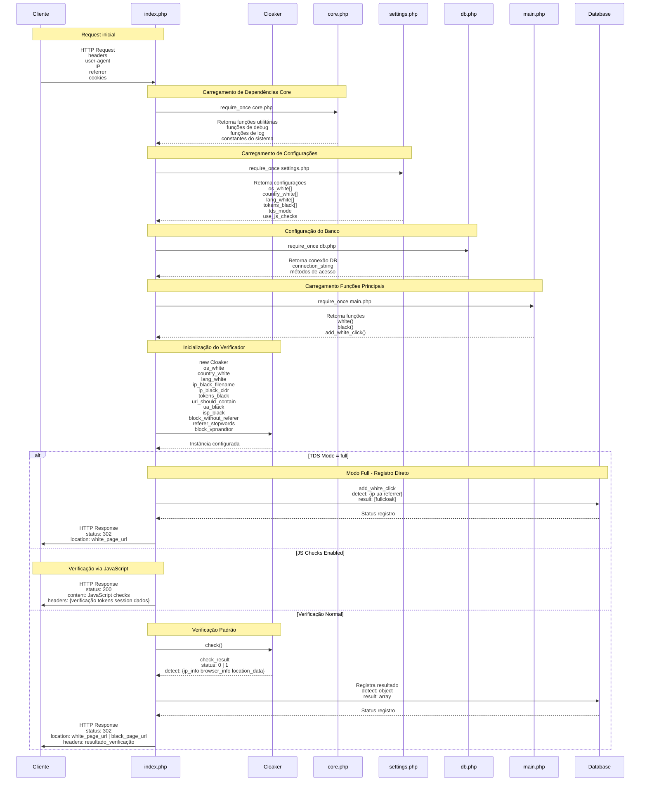

```mermaid
sequenceDiagram
    participant C as Cliente
    participant I as index.php
    participant CL as Cloaker
    participant CO as core.php
    participant S as settings.php
    participant D as db.php
    participant M as main.php
    participant DB as Database

    Note over C,I: Request inicial
    C->>I: HTTP Request<br/>headers<br/>user-agent<br/>IP<br/>referrer<br/>cookies
    
    Note over I,CO: Carregamento de Dependências Core
    I->>CO: require_once core.php
    CO-->>I: Retorna funções utilitárias<br/>funções de debug<br/>funções de log<br/>constantes do sistema

    Note over I,S: Carregamento de Configurações
    I->>S: require_once settings.php
    S-->>I: Retorna configurações<br/>os_white[]<br/>country_white[]<br/>lang_white[]<br/>tokens_black[]<br/>tds_mode<br/>use_js_checks

    Note over I,D: Configuração do Banco
    I->>D: require_once db.php
    D-->>I: Retorna conexão DB<br/>connection_string<br/>métodos de acesso

    Note over I,M: Carregamento Funções Principais
    I->>M: require_once main.php
    M-->>I: Retorna funções<br/>white()<br/>black()<br/>add_white_click()
    
    Note over I,CL: Inicialização do Verificador
    I->>CL: new Cloaker<br/>os_white<br/>country_white<br/>lang_white<br/>ip_black_filename<br/>ip_black_cidr<br/>tokens_black<br/>url_should_contain<br/>ua_black<br/>isp_black<br/>block_without_referer<br/>referer_stopwords<br/>block_vpnandtor
    CL-->>I: Instância configurada

    alt TDS Mode = full
        Note over I,DB: Modo Full - Registro Direto
        I->>DB: add_white_click<br/>detect: {ip ua referrer}<br/>result: [fullcloak]
        DB-->>I: Status registro
        I->>C: HTTP Response<br/>status: 302<br/>location: white_page_url

    else JS Checks Enabled
        Note over I,C: Verificação via JavaScript
        I->>C: HTTP Response<br/>status: 200<br/>content: JavaScript checks<br/>headers: {verificação tokens session dados}

    else Verificação Normal
        Note over I,CL: Verificação Padrão
        I->>CL: check()
        CL-->>I: check_result<br/>status: 0 | 1<br/>detect: {ip_info browser_info location_data}
        
        I->>DB: Registra resultado<br/>detect: object<br/>result: array
        DB-->>I: Status registro
        
        I->>C: HTTP Response<br/>status: 302<br/>location: white_page_url | black_page_url<br/>headers: resultado_verificação
    end
```
