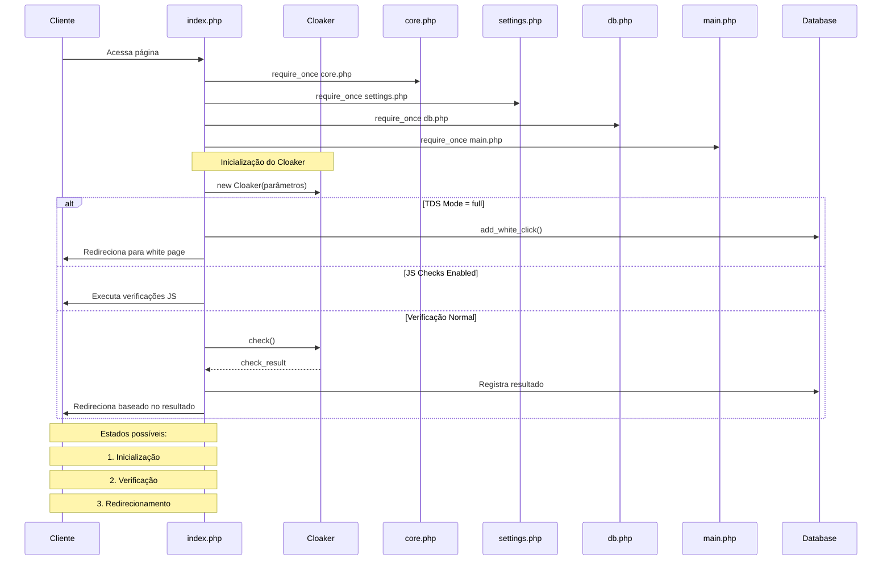
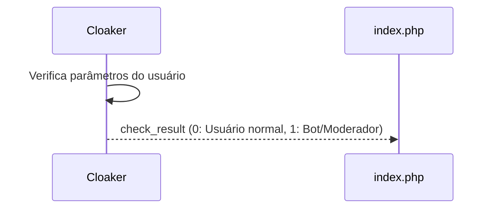

# Detalhamento dos Participantes e suas Interações

## 1. Cliente (C)

**Papel:** Usuário final que acessa o sistema através do navegador
**Interações:**

- **Entrada:** Acessa a página inicial (HTTP Request)
- **Retorno:** Recebe redirecionamento para white page ou black page

## 2. index.php (I)

**Papel:** Controlador principal do sistema, orquestra todo o fluxo de
verificação **Interações:**

- **Entrada:** Requisição HTTP do cliente
- **Saída para core.php:** Solicita funcionalidades básicas do sistema
- **Saída para settings.php:** Solicita configurações do sistema
- **Saída para db.php:** Solicita conexão com banco de dados
- **Saída para main.php:** Solicita funções principais
- **Saída para Cloaker:** Instancia com parâmetros de configuração

```mermaid
sequenceDiagram
    participant I as index.php
    participant CL as Cloaker
    
    I->>CL: new Cloaker(
        os_white,
        country_white,
        lang_white,
        ip_black_filename,
        ip_black_cidr,
        tokens_black,
        url_should_contain,
        ua_black,
        isp_black,
        block_without_referer,
        referer_stopwords,
        block_vpnandtor
    )
```

## 3. Cloaker (CL)

**Papel:** Responsável pela lógica de verificação e detecção **Interações:**

- **Entrada:** Parâmetros de configuração na instanciação
- **Saída:** Resultado da verificação (check_result)



## 4. core.php (CO)

**Papel:** Fornece funcionalidades básicas e utilitárias do sistema
**Interações:**

- **Entrada:** Solicitação de inclusão do arquivo
- **Saída:** Disponibiliza funções core do sistema

## 5. settings.php (S)

**Papel:** Gerencia configurações e parâmetros do sistema **Interações:**

- **Entrada:** Solicitação de inclusão do arquivo
- **Saída:** Variáveis de configuração:
  - Configurações de white/black list
  - Modos de operação (TDS)
  - Configurações de verificação JS

## 6. db.php (D)

**Papel:** Gerencia conexões e operações com banco de dados **Interações:**

- **Entrada:** Solicitação de inclusão do arquivo
- **Saída:** Interface de conexão com banco de dados

## 7. main.php (M)

**Papel:** Contém funções principais do sistema **Interações:**

- **Entrada:** Solicitação de inclusão do arquivo
- **Saída:** Funções principais como:
  - white(): Função para redirecionamento white page
  - black(): Função para redirecionamento black page
  - add_white_click(): Registro de clicks

## 8. Database (DB)

**Papel:** Armazenamento persistente de dados **Interações:**

```mermaid
sequenceDiagram
    participant I as index.php
    participant DB as Database
    
    I->>DB: add_white_click(
        detect: array, // Informações detectadas
        result: array  // Resultado da verificação
    )
    DB-->>I: Confirmação de registro
```

## Estados do Sistema

1. **Estado de Inicialização**
   - Sistema carrega dependências
   - Configurações são estabelecidas
   - Cloaker é instanciado

2. **Estado de Verificação**
   - Análise do modo TDS
   - Verificações JS (se habilitadas)
   - Verificações do Cloaker

3. **Estado de Redirecionamento**
   - Registro de resultado no banco
   - Redirecionamento do usuário
