# Diagrama de Sequência do TDS (Traffic Distribution System)

Este diagrama detalha o fluxo de processamento do sistema TDS (Traffic Distribution System), incluindo a funcionalidade de whitelist de IPs em formato CIDR e o comportamento de exibição das páginas na URL raiz conforme as configurações.

```mermaid
sequenceDiagram
    participant C as Cliente
    participant I as index.php
    participant CL as Cloaker
    participant IU as IpUtils
    participant DB as Banco de Dados
    participant PL as Prelanding
    participant BL as Black Page
    participant WH as White Page

    Note over C,I: Request inicial
    C->>I: HTTP Request<br/>IP: {ip}<br/>headers: {headers}<br/>user-agent: {ua}<br/>referrer: {referrer}<br/>cookies: {cookies}

    Note over I,CL: Carregamento e Inicialização
    I->>CL: new Cloaker(configurações)<br/>{os_white, country_white, ip_black_filename, ip_black_cidr, ...}
    
    Note over CL: Método detect() obtém informações do cliente
    CL->>CL: detect()<br/>{ip, ua, os, country, lang, isp}
    
    alt TDS Mode = full
        Note over I,DB: Modo Full - Todos vão para White
        I->>DB: add_white_click(detect, ['fullcloak'])<br/>{ip, ua, country, os, isp, reason: ['fullcloak']}
        DB-->>I: Status: {success: true}
        I->>WH: Redirecionamento para White Page
        WH-->>C: HTTP 200<br/>content: White Page HTML
    else TDS Mode = off ou normal
        Note over I,CL: Verificação do IP
        I->>CL: check()
        
        Note over CL,IU: 1. Verificar primeiro whitelist de IPs (CIDR)
        CL->>IU: checkIp(IP_cliente, lista_whitelist)<br/>{ip, cidr_list: [192.168.0.0/16, 127.0.0.1, ...]}
        
        alt IP na Whitelist
            IU-->>CL: true (IP na whitelist)
            CL-->>I: resultado = 0<br/>whitelist_match = true<br/>result = ['whitelist']
            
            alt Prelanding ativa (black.prelanding.action = folder)
                Note over I,DB: Exibir Prelanding na URL raiz
                I->>DB: add_black_click(subid, detect, prelanding, '')<br/>{subid, ip, ua, prelanding: 'preland1', landing: ''}
                DB-->>I: Status: {success: true}
                I->>PL: Servir arquivo da pasta Prelanding diretamente
                PL-->>C: HTTP 200<br/>content: Prelanding HTML
            else Prelanding inativa
                Note over I,DB: Exibir Black Page na URL raiz
                I->>DB: add_black_click(subid, detect, '', landing)<br/>{subid, ip, ua, prelanding: '', landing: 'site4'}
                DB-->>I: Status: {success: true}
                I->>BL: Servir arquivo da pasta Black diretamente
                BL-->>C: HTTP 200<br/>content: Black Page HTML
            end
        else IP não na Whitelist, Verificação Normal
            IU-->>CL: false (IP não na whitelist)
            
            Note over CL,IU: 2. Verificar lista de bots
            CL->>IU: checkIp(IP_cliente, lista_bots)<br/>{ip, bot_list: [cidr_ranges]}
            
            alt IP é Bot
                IU-->>CL: true (IP é bot)
                CL-->>I: resultado = 1<br/>result = ['ipbase']
                I->>DB: add_white_click(detect, ['ipbase'])<br/>{ip, ua, country, os, isp, reason: ['ipbase']}
                DB-->>I: Status: {success: true}
                I->>WH: Servir arquivo da pasta White diretamente
                WH-->>C: HTTP 200<br/>content: White Page HTML
            else IP não é Bot
                IU-->>CL: false (IP não é bot)
                
                Note over CL: 3. Verificações Adicionais
                CL->>CL: Verificar IP na blacklist<br/>{ip, blacklist_file}
                CL->>CL: Verificar VPN/Tor<br/>{ip, blackbox_service}
                CL->>CL: Verificar User Agent<br/>{ua, ua_blacklist}
                CL->>CL: Verificar Sistema Operacional<br/>{os, os_whitelist}
                CL->>CL: Verificar País<br/>{country, country_whitelist}
                CL->>CL: Verificar Idioma<br/>{lang, lang_whitelist}
                CL->>CL: Verificar Tokens na URL<br/>{url, token_blacklist}
                CL->>CL: Verificar Referer<br/>{referer, referer_rules}
                CL->>CL: Verificar ISP<br/>{isp, isp_blacklist}
                
                alt Alguma verificação falhou
                    CL-->>I: resultado = 1<br/>result = ['country', 'os', 'ua', ...]
                    I->>DB: add_white_click(detect, result)<br/>{ip, ua, country, os, isp, reason: result}
                    DB-->>I: Status: {success: true}
                    I->>WH: Servir arquivo da pasta White diretamente
                    WH-->>C: HTTP 200<br/>content: White Page HTML
                else Todas verificações passaram
                    CL-->>I: resultado = 0 (usuário permitido)
                    
                    alt Prelanding ativa (black.prelanding.action = folder)
                        I->>DB: add_black_click(subid, detect, prelanding, '')<br/>{subid, ip, ua, prelanding: 'preland1', landing: ''}
                        DB-->>I: Status: {success: true}
                        I->>PL: Servir arquivo da pasta Prelanding diretamente
                        PL-->>C: HTTP 200<br/>content: Prelanding HTML
                    else Prelanding inativa
                        I->>DB: add_black_click(subid, detect, '', landing)<br/>{subid, ip, ua, prelanding: '', landing: 'site4'}
                        DB-->>I: Status: {success: true}
                        I->>BL: Servir arquivo da pasta Black diretamente
                        BL-->>C: HTTP 200<br/>content: Black Page HTML
                    end
                end
            end
        end
    end
```



## Detalhamento do Fluxo de Dados

### 1. Verificação de IP na Whitelist (CIDR)

- **Estado Inicial**: Usuário acessa o site (`/`), IP é identificado
- **Dados Enviados**:
  - Request HTTP com informações do cliente:
    - IP: `127.0.0.1` ou `::1` (localhost)
    - User-Agent: `Mozilla/5.0...` (navegador do cliente)
    - Referrer: URL de origem (se disponível)
    - Cookies: cookies existentes do cliente
- **Fonte de Dados**:
  - Arquivo `bases/whitelist.txt`: Lista de IPs/redes em formato CIDR
  - Exemplo:
    ```
    127.0.0.1
    192.168.0.0/16
    ::1/128
    ```
- **Processamento**:
  - Sistema carrega a lista de IPs/redes da whitelist
  - Filtra comentários e linhas vazias
  - Verifica se o IP do cliente corresponde a algum padrão usando `IpUtils::checkIp()`
  - Se houver correspondência, define `whitelist_match = true`
- **Resposta**:
  - Se match: `resultado = 0, whitelist_match = true, result = ['whitelist']`
- **Estado Final**:
  - Se o IP estiver na whitelist, o usuário vai diretamente para a Black Page ou Prelanding

### 2. Exibição de Prelanding ou Black Page na URL Raiz

- **Estado Inicial**: IP verificado e aprovado na whitelist ou todas verificações passaram
- **Verificação de Configuração**:
  - Verifica `black.prelanding.action` no `settings.json`
- **Comportamento**:
  - Se `black.prelanding.action = folder`:
    - Seleciona uma das pastas em `black.prelanding.folders` (usando A/B testing se configurado)
    - Registra no banco de dados `add_black_click()`
    - Exibe a prelanding diretamente na URL raiz
  - Se `black.prelanding.action != folder`:
    - Seleciona uma pasta em `black.landing.folder.names`
    - Registra no banco de dados `add_black_click()`
    - Exibe a black page diretamente na URL raiz
- **Resposta ao Cliente**:
  - HTTP 200 com conteúdo HTML da página selecionada
  - Base path ajustado para garantir que os links relativos funcionem
  - Script de rastreamento de cliques adicionado para registro de estatísticas

### 3. Registro de Cliques e Estatísticas

- **Estado Inicial**: Usuário visualiza Prelanding ou Black Page
- **Ação do Cliente**: Clique em botão com ID "ctaButton"
- **Dados Enviados**:
  - Request POST para `/buttonlog.php`
  - Payload JSON:
    ```json
    {
      "event": "lead_click",
      "prelanding": "preland1",
      "timestamp": "2023-03-19T12:00:00.000Z"
    }
    ```
- **Processamento**:
  - Registro do clique no banco de dados
  - Atualização das estatísticas de conversão
- **Resposta**:
  - JSON: `{"success": true}`
  - Redirecionamento para URL de destino original
- **Verificação nas Estatísticas**:
  - Os cliques podem ser visualizados em:
    - `/admin/index.php?password=12345`
    - `/admin/statistics.php?password=12345`
    - `/admin/index.php?filter=leads&password=12345`

### 4. Mudanças de Estado das Interações

1. **Request Inicial** → **Detecção de Dados do Cliente**
   - Estado: Dados brutos do cliente
   - Mudança: Extração e organização das informações do cliente

2. **Detecção de Dados** → **Verificação de Whitelist**
   - Estado: Dados do cliente organizados
   - Mudança: Aplicação da primeira regra de verificação (whitelist)

3. **Verificação de Whitelist** → **Exibição de Black/Prelanding**
   - Estado: IP na whitelist (whitelist_match = true)
   - Mudança: Seleção da página adequada e exibição direta

4. **Verificação de Whitelist** → **Verificações Adicionais**
   - Estado: IP não está na whitelist (whitelist_match = false)
   - Mudança: Aplicação de regras adicionais de verificação

5. **Verificações Adicionais** → **Exibição de White Page**
   - Estado: Falha em alguma verificação (resultado = 1)
   - Mudança: Redirecionamento para White Page

6. **Verificações Adicionais** → **Exibição de Black/Prelanding**
   - Estado: Todas verificações passaram (resultado = 0)
   - Mudança: Seleção da página adequada e exibição direta

7. **Visualização da Página** → **Clique no Botão**
   - Estado: Usuário visualizando a página
   - Mudança: Registro de evento de clique

8. **Clique no Botão** → **Registro nas Estatísticas**
   - Estado: Evento de clique capturado
   - Mudança: Dados persistidos no banco para análise posterior 