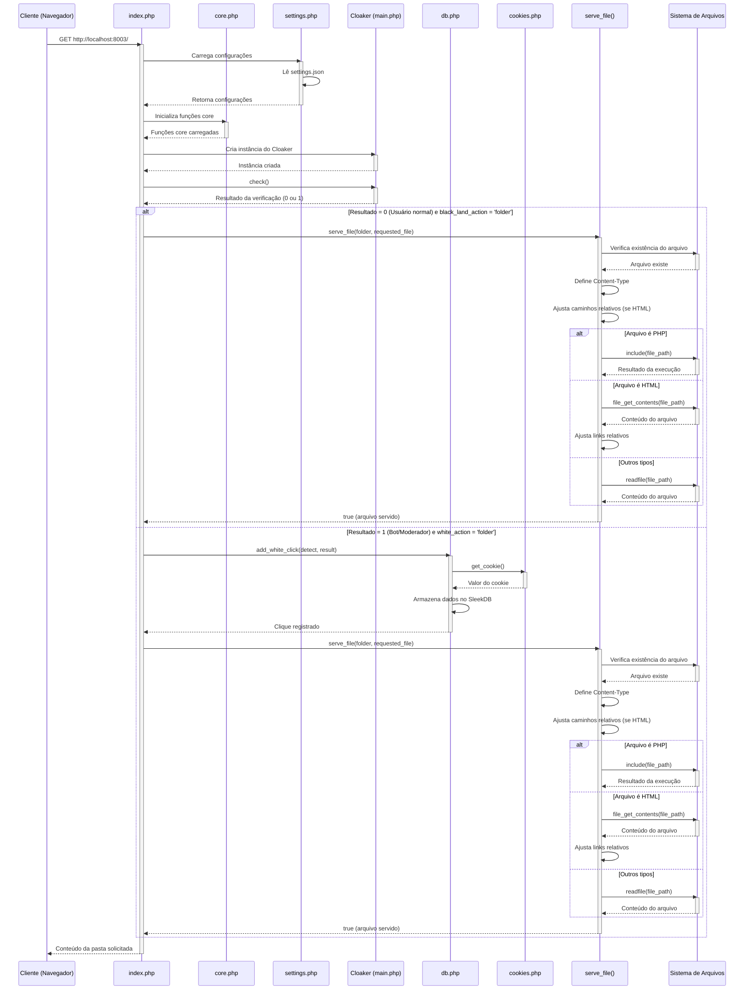

# Diagrama de Sequência: Exibição de Conteúdo de Pastas na URL Raiz

Este diagrama de sequência ilustra o fluxo de processamento quando a opção
"pasta" está selecionada nas configurações, permitindo que o sistema exiba o
conteúdo das pastas white ou black diretamente na URL raiz
(http://localhost:8003/) sem redirecionamento.

## Detalhamento do Fluxo

### Participantes

1. **Cliente (Navegador)**: Inicia a requisição para a URL raiz.
2. **index.php**: Ponto de entrada da aplicação que coordena o fluxo.
3. **core.php**: Contém funções essenciais do sistema.
4. **settings.php**: Carrega as configurações do arquivo settings.json.
5. **Cloaker (main.php)**: Responsável por detectar bots, moderadores e usuários
   normais.
6. **db.php**: Gerencia o armazenamento de dados usando SleekDB.
7. **cookies.php**: Gerencia cookies e sessões.
8. **serve_file()**: Função que serve arquivos estáticos e dinâmicos.
9. **Sistema de Arquivos**: Representa o sistema de arquivos do servidor.

### Fluxo de Dados

1. **Requisição Inicial**:
   - O cliente faz uma requisição GET para http://localhost:8003/
   - O index.php é acionado e carrega as configurações e dependências

2. **Verificação do Usuário**:
   - O Cloaker verifica se o usuário é um bot/moderador ou um usuário normal
   - Retorna 0 para usuário normal, 1 para bot/moderador

3. **Servindo Conteúdo da Pasta**:
   - Se o usuário for normal e black_land_action for 'folder':
     - A função serve_file() é chamada com a pasta black selecionada
   - Se o usuário for bot/moderador e white_action for 'folder':
     - O clique é registrado no banco de dados
     - A função serve_file() é chamada com a pasta white selecionada

4. **Processamento do Arquivo**:
   - A função serve_file() verifica a existência do arquivo
   - Define o Content-Type apropriado
   - Para arquivos PHP: inclui o arquivo para execução
   - Para arquivos HTML: ajusta os caminhos relativos e serve o conteúdo
   - Para outros tipos: serve o conteúdo diretamente

5. **Resposta ao Cliente**:
   - O conteúdo processado é enviado de volta ao cliente

### Estados do Sistema

1. **Estado Inicial**: Sistema aguardando requisição
2. **Carregamento de Configurações**: Sistema carrega configurações e
   dependências
3. **Verificação de Usuário**: Sistema determina o tipo de usuário
4. **Seleção de Pasta**: Sistema seleciona a pasta apropriada (white ou black)
5. **Processamento de Arquivo**: Sistema processa o arquivo solicitado
6. **Resposta**: Sistema envia a resposta ao cliente

Este fluxo garante que o conteúdo das pastas seja servido diretamente na URL
raiz, sem necessidade de redirecionamento, mantendo a funcionalidade de filtrar
entre conteúdo white e black com base no tipo de usuário.
