# Diagrama de Sequência para Registro de Lead e Redirecionamento após Captura (Atualizado)

```mermaid
sequenceDiagram
    participant Usuario as Usuário
    participant LP as Landing Page (offer2)
    participant FormProc as Processador de Formulário (form-processor.php)
    participant Sistema as Sistema
    participant BD as Banco de Dados JSON
    participant Storage as LocalStorage
    participant AdminUI as Interface Administrativa
    participant Webhook as Webhook Externo
    participant Redir as URL de Redirecionamento

    %% Carregamento inicial da landing page
    Usuario->>LP: Acessa a landing page (/offer2/)
    Note over LP: Estado: "Página inicial carregada"
    LP->>Usuario: Exibe formulário de captura de email

    %% Interação do usuário com o formulário
    Usuario->>LP: Preenche email e outros dados
    Usuario->>LP: Clica no botão de envio
    Note over LP: Estado: "Formulário submetido"
    LP->>LP: Mostra indicador de carregamento "Preparando tu acceso..."
    
    %% Processamento do formulário no servidor
    LP->>FormProc: Submete formulário para /form-processor.php (POST)<br>Payload: {name, email, phone}<br>Com timeout de 10s
    Note over FormProc: Estado: "Processando dados do formulário"
    
    %% Processamento no servidor
    FormProc->>Sistema: Recebe e valida dados (email, nome, etc.)
    Sistema->>Sistema: Gera/recupera subid do cookie
    
    alt Dados válidos e servidor responde dentro do timeout
        %% Registro do lead
        Sistema->>BD: Registra lead (subid, nome, email, etc.)
        Note over BD: Estado: "Lead registrado"
        BD-->>Sistema: Confirmação de registro
        
        %% Verificação da URL de redirecionamento
        Sistema->>Sistema: Verifica black_land_redirect_url
        
        alt black_land_redirect_url está definido
            FormProc-->>LP: Resposta de sucesso (JSON)
            LP->>LP: Exibe mensagem de sucesso (verde)
            LP->>Usuario: Exibe "¡Tu solicitud ha sido procesada con éxito! Serás redirigido en breve."
            LP->>Redir: Redireciona para URL personalizada (após 1s)<br>Ex: "https://dekoola.com/ch/hack/"
            Note over Usuario: Estado: "Redirecionado para URL externa"
        else black_land_redirect_url não definido
            %% Com a correção, não precisamos mais verificar thankyou.php
            FormProc-->>LP: Resposta de sucesso (JSON)
            LP->>LP: Exibe mensagem de sucesso (verde)
            LP->>Redir: Redireciona para /thankyou.html (após 1s)
            Note over Usuario: Estado: "Página de agradecimento padrão exibida"
        end
        
        %% Processamento assíncrono opcional
        par Envio para webhook externo
            Sistema->>Webhook: Envia dados para webhook externo (se configurado)
            Note over Webhook: Estado: "Processando dados externos"
            Webhook-->>Sistema: Resposta (sucesso/erro)
        end
    else Dados inválidos ou erro no servidor ou timeout
        alt Dados inválidos
            FormProc-->>LP: Retorna mensagem de erro (JSON)
            LP->>LP: Exibe mensagem de erro (vermelho)
            LP->>Usuario: Exibe "Por favor, introduce un email válido." ou outro erro específico
            Note over Usuario: Estado: "Erro de validação exibido"
        else Erro no servidor ou timeout
            Note over LP: Sistema de tratamento de erro aprimorado ativado
            LP->>Storage: Armazena dados do formulário (nome, email) no localStorage
            LP->>LP: Exibe mensagem informativa (azul)
            LP->>Usuario: Exibe "Estamos procesando tu información. Serás redirigido a la siguiente página."
            LP->>Redir: Redireciona para URL personalizada (após 2s)<br>Ex: "https://dekoola.com/ch/hack/"
            Note over Usuario: Estado: "Redirecionado com experiência positiva mesmo após erro"
        end
    end
    
    %% Processo de edição da URL de redirecionamento (área administrativa)
    rect rgb(2, 2, 85)
    note right of AdminUI: Problema identificado: Não é possível editar<br>a URL de redirecionamento na interface
    
    Usuario->>AdminUI: Acessa página de configurações (/admin/editsettings.php)
    AdminUI->>Usuario: Exibe formulário com campo black.landing.folder.redirect_url
    Usuario->>AdminUI: Edita URL e submete formulário
    AdminUI->>Sistema: Envia requisição para salvar configurações (/admin/savesettings.php)
    
    Note over Sistema: Problema: Os parâmetros POST são transformados<br>incorretamente (pontos convertidos para underscores)
    
    Sistema->>Sistema: Erro ao processar 'black.landing.folder.redirect_url'<br>Procura por 'black_landing_folder_redirect_url'
    Sistema-->>AdminUI: Redireciona sem aplicar alterações
    AdminUI->>Usuario: Exibe página de configurações sem alterações
    end
```



## Solução Implementada e Recomendações

### 1. Problema identificado na edição da URL de redirecionamento

**Causa raiz**: O código em `admin/savesettings.php` está convertendo pontos para underscores ao processar os dados do formulário, mas depois tenta acessar as chaves com pontos na configuração.

```php
foreach($_POST as $key=>$value){
    $confkey=str_replace('_','.',$key); // Converte underscores para pontos, mas precisa ser o contrário para funcionar
```

**Correção recomendada**: Modificar o código para que ele trate corretamente os nomes dos campos com pontos ou ajustar o nome do campo no formulário.

### 2. Simplificação do fluxo de redirecionamento

**Problema**: A lógica atual verifica desnecessariamente a existência de `thankyou.php`, criando complexidade.

**Correção**: Eliminar a lógica relacionada ao `thankyou.php` e utilizar apenas o redirecionamento direto:
- Se `black_land_redirect_url` estiver definido: redirecionar para essa URL
- Caso contrário: redirecionar para `thankyou.html`

### 3. Melhorias na experiência do usuário (UX)

**Implementações**: 
- Adicionado sistema de fallback que redireciona o usuário mesmo em caso de erro no servidor
- Implementado armazenamento local de dados do formulário para possível recuperação
- Otimizadas as mensagens para o usuário para manter uma experiência positiva
- Adicionado timeout para evitar esperas prolongadas em caso de falha do servidor

## Análise do Estado de Transição Atualizado

| Estado | Descrição | Evento de Transição | Próximo Estado |
|--------|-----------|---------------------|----------------|
| Página inicial carregada | Usuário visualiza o formulário | Preenchimento e envio do formulário | Formulário submetido |
| Formulário submetido | Dados enviados ao servidor | Processamento pelo servidor | Processando dados do formulário |
| Processando dados do formulário | Sistema valida e registra o lead | Redirecionamento | Redirecionado para URL externa ou Página de agradecimento padrão exibida |
| Lead registrado | Dados armazenados no banco de dados | N/A | N/A |
| Redirecionado para URL externa | Usuário é enviado para URL definida em `black_land_redirect_url` | N/A | N/A |
| Página de agradecimento padrão exibida | Usuário visualiza thankyou.html | N/A | N/A |
| Redirecionado com experiência positiva mesmo após erro | Usuário é redirecionado mesmo quando ocorre erro | N/A | N/A |

## Fontes de Dados Envolvidas

1. **Banco de Dados JSON**
   - Localização: `/logs/leads/` - Armazena informações dos leads registrados
   - Campos: subid, nome, email, timestamp, status, etc.

2. **Arquivos de Configuração**
   - `settings.json` - Define configurações do sistema incluindo URL de redirecionamento
   - Parâmetros relevantes:
     - `black.landing.folder.redirect_url: "https://dekoola.com/ch/hack/"` - URL para redirecionamento após submissão do formulário

3. **Armazenamento Local**
   - `localStorage` do navegador - Usado para backup de dados do formulário em caso de falha
   - Chaves: `form_name`, `form_email` - Armazenam dados do último envio com falha

## Detalhes das Requisições e Respostas

### Submissão do Formulário:
- **Requisição**: 
  - Método: `POST`
  - URL: `/form-processor.php`
  - Dados: `email=usuario@exemplo.com&name=Nome&phone=Telefone`
  - Timeout: 10 segundos (para evitar esperas prolongadas)
  
- **Processamento**:
  1. Validação de dados
  2. Geração/recuperação de subid do cookie
  3. Registro no banco de dados
  4. Verificação da URL de redirecionamento
  
- **Resposta de Sucesso**: 
  - Código HTTP: 200 OK
  - Corpo: JSON com confirmação
  - Ação do Cliente: Exibe mensagem de sucesso e redireciona para URL configurada ou fallback
  
- **Resposta de Erro ou Timeout**:
  - Código HTTP: 4xx/5xx ou nenhuma resposta (timeout)
  - Ação do Cliente: Salva dados no localStorage, exibe mensagem informativa e redireciona

## Experiência do Usuário (UX)

O sistema foi otimizado para proporcionar uma experiência de usuário consistente e positiva em todos os cenários:

1. **Indicadores Visuais**:
   - **Carregamento**: Texto "Preparando tu acceso..." com animação de spinner
   - **Sucesso**: Mensagem em verde com ícone de verificação
   - **Informação**: Mensagem em azul com ícone de informação (em vez de mensagem de erro)

2. **Abordagem Positiva para Erros**:
   - Em vez de mostrar mensagens de erro técnicas, apresentamos mensagens informativas
   - Mesmo em caso de falha, garantimos que o usuário seja redirecionado para continuar sua jornada
   - Melhor experiência para usuários em conexões lentas ou instáveis

3. **Tempos de Redirecionamento**:
   - Sucesso: Redirecionamento após 1 segundo
   - Falha/Informação: Redirecionamento após 2 segundos (tempo suficiente para ler a mensagem) 