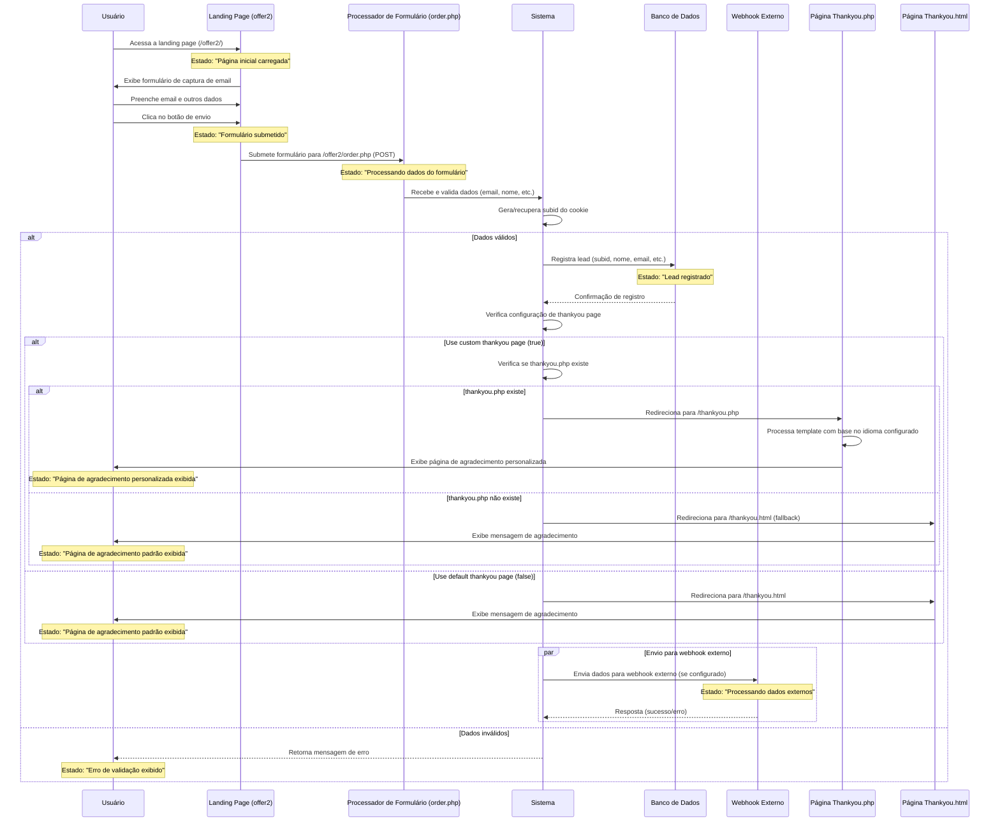

# Diagrama de Sequência para Registro de Lead e Redirecionamento Thankyou (Atualizado)

## Solução Implementada

Ao analisar o código e a configuração, foram realizadas as seguintes alterações:

1. **Criação do arquivo thankyou.php**: Foi criado um arquivo thankyou.php na raiz do projeto para processar corretamente o redirecionamento quando a configuração `customthankyoupage.use` está habilitada.

2. **Implementação de fallback no order.php**: Foi adicionada uma verificação no arquivo order.php para garantir que o redirecionamento ocorra para um arquivo existente, com fallback para thankyou.html caso necessário.

3. **Suporte a idiomas e upsel**l: O arquivo thankyou.php implementa o suporte a diferentes idiomas conforme configurado em settings.json, e também suporta a exibição de ofertas de upsell quando configuradas.

## Análise do Estado de Transição Atualizado

| Estado | Descrição | Evento de Transição | Próximo Estado |
|--------|-----------|---------------------|----------------|
| Página inicial carregada | Usuário visualiza o formulário | Preenchimento e envio do formulário | Formulário submetido |
| Formulário submetido | Dados enviados ao servidor | Processamento pelo servidor | Processando dados do formulário |
| Processando dados do formulário | Sistema valida e registra o lead | Redirecionamento | Página de agradecimento exibida |
| Lead registrado | Dados armazenados no banco de dados | N/A | N/A |
| Página de agradecimento personalizada exibida | Usuário visualiza confirmação de registro com opções de upsell | N/A | N/A |
| Página de agradecimento padrão exibida | Usuário visualiza confirmação simples de registro | N/A | N/A |

## Fontes de Dados Envolvidas

1. **Banco de Dados JSON**
   - Localização: `/logs/leads/` - Armazena informações dos leads registrados
   - Campos: subid, nome, email, timestamp, status, etc.

2. **Arquivos de Configuração**
   - `settings.json` - Define configurações do sistema incluindo thankyou page
   - Parâmetros relevantes:
     - `black.landing.folder.customthankyoupage.use: true` - Usa página de agradecimento personalizada
     - `black.landing.folder.customthankyoupage.language: "PT"` - Idioma da página de agradecimento
     - `black.landing.folder.customthankyoupage.upsell.use: false` - Exibição de upsell desativada

3. **Templates de Thankyou Page**
   - `/thankyou/templates/{IDIOMA}.html` - Templates por idioma
   - `/thankyou/templates/email/{IDIOMA}fill.html` - Formulários de email por idioma

## Detalhes das Requisições e Respostas

### Submissão do Formulário:
- **Requisição**: 
  - Método: `POST`
  - URL: `/offer2/order.php`
  - Dados: `email=usuario@exemplo.com&name=Nome&phone=Telefone`
  
- **Resposta Atual (Corrigida)**: 
  - Redirecionamento para `/thankyou.php` se existir, ou `/thankyou.html` como fallback
  
### Processamento da Página de Agradecimento:
- **Requisição**: 
  - Método: `GET`
  - URL: `/thankyou.php`
  
- **Processamento**:
  1. Recuperação de dados do lead via subid (cookie)
  2. Carregamento do template baseado no idioma configurado
  3. Substituição de variáveis no template (nome, telefone, etc.)
  4. Inclusão de conteúdo de upsell se configurado
  5. Exibição da página personalizada ao usuário 