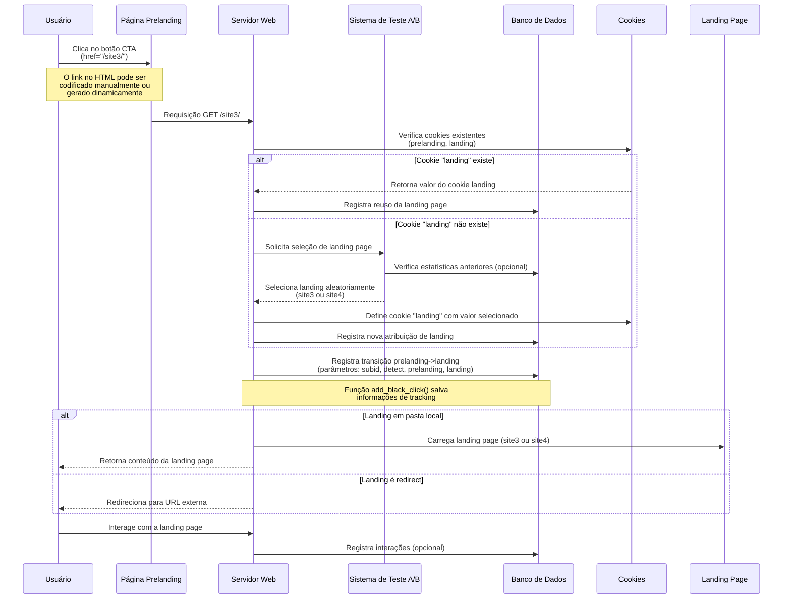

# Diagrama de Sequência - Transição de CTA para Landing Page (Teste A/B)

## Descrição do Caso de Uso

Este documento detalha o fluxo desde o clique no botão CTA (Call-To-Action) na
página de prelanding até a exibição da landing page, incluindo como o sistema
seleciona a landing page para testes A/B.

## Diagrama de Sequência

## Detalhamento do Fluxo de Dados

### 1. Clique no CTA

- **Estado Inicial**: Usuário visualizando prelanding
- **Dados Enviados**:
  - URL do link: `/site3/` (pode ser hardcoded ou dinâmico)
  - Cookies existentes no navegador
  - Parâmetros da URL (se houver)
- **Mudança de Estado**: Inicia requisição para a landing page

### 2. Processamento da Requisição

- **Dados Recebidos pelo Servidor**:
  - Path solicitado: `/site3/`
  - HTTP Headers (User-Agent, Referer, etc.)
  - Cookies do cliente
- **Fontes de Dados Consultadas**:
  - `settings.json`: Configuração de landings disponíveis
  - Cookies: Verificação de sessions existentes
  - Banco de dados: Histórico do usuário (opcional)

### 3. Seleção da Landing Page

- **Lógica de Decisão**:
  - Função `select_landing()` em abtest.php
  - Parâmetros:
    - `$save_user_flow`: Flag para manter consistência entre sessões
    - `$landings`: Array de landing pages disponíveis
    - `$isfolder`: Flag indicando se landing é pasta local
  - **Algoritmo**:
    - Se cookie "landing" existe e é válido:
      - Usa valor do cookie (mantém consistência)
    - Caso contrário:
      - Seleciona landing aleatoriamente (teste A/B)
      - Salva em cookie para visitas futuras
- **Dados Gerados**:
  - Nova entrada no banco de dados (tabela de cliques)
  - Cookie "landing" (se não existia)

### 4. Exibição da Landing Page

- **Estado Final**:
  - Usuário visualizando landing page (local ou redirecionada)
  - Sistema com dados de rastreamento atualizados
- **Dados Armazenados**:
  - Banco de dados: Registro da transição
  - Cookies: Identificadores de prelanding e landing
  - Estatísticas: Métricas para análise posterior

## Fontes de Dados Envolvidas

1. **settings.json**
   - Configuração de prelanding e landing pages
   - Opções de redirecionamento
   - Parâmetros de teste A/B

2. **Banco de Dados**
   - Tabela de cliques (transições)
   - Tabela de estatísticas (conversões)
   - Tabela de usuários (opcional)

3. **Cookies**
   - "prelanding": Identifica qual prelanding foi mostrada
   - "landing": Identifica qual landing foi/será mostrada
   - Outros cookies de rastreamento (opcionais)

4. **HTML da Prelanding**
   - Contém link direto para landing ou path genérico
   - Pode incluir parâmetros ou macros para tracking

## Considerações Técnicas

1. **Links Hardcoded vs. Dinâmicos**
   - O CTA na prelanding pode apontar para um caminho fixo (ex: `/site3/`)
   - Alternativa: usar script para gerar link dinamicamente com base em cookies

2. **Consistência de Teste A/B**
   - Por padrão, o sistema mantém consistência via cookies
   - Isso garante que o mesmo usuário veja a mesma variante em visitas
     subsequentes
   - Configurável via parâmetro `$save_user_flow`

3. **Páginas Alternativas para Teste A/B**
   - Qualquer página com link para a landing pode iniciar o teste A/B
   - URLs diretas: `dominio.com/site3/` ou `dominio.com/site4/` ignoram o teste
   - Apenas redirecionamentos através do sistema ativam o mecanismo de seleção
