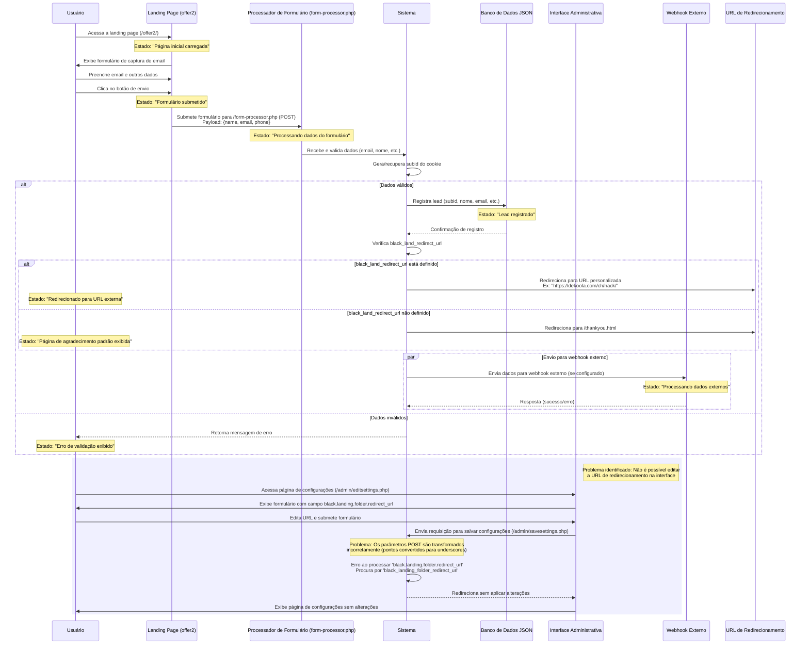

# Diagrama de Sequência para Registro de Lead e Redirecionamento após Captura (Atualizado)



## Solução Implementada e Recomendações

### 1. Problema identificado na edição da URL de redirecionamento

**Causa raiz**: O código em `admin/savesettings.php` está convertendo pontos para underscores ao processar os dados do formulário, mas depois tenta acessar as chaves com pontos na configuração.

```php
foreach($_POST as $key=>$value){
    $confkey=str_replace('_','.',$key); // Converte underscores para pontos, mas precisa ser o contrário para funcionar
```

**Correção recomendada**: Modificar o código para que ele trate corretamente os nomes dos campos com pontos ou ajustar o nome do campo no formulário.

### 2. Simplificação do fluxo de redirecionamento

**Problema**: A lógica atual verifica desnecessariamente a existência de `thankyou.php`, criando complexidade.

**Correção**: Eliminar a lógica relacionada ao `thankyou.php` e utilizar apenas o redirecionamento direto:
- Se `black_land_redirect_url` estiver definido: redirecionar para essa URL
- Caso contrário: redirecionar para `thankyou.html`

## Análise do Estado de Transição Atualizado

| Estado | Descrição | Evento de Transição | Próximo Estado |
|--------|-----------|---------------------|----------------|
| Página inicial carregada | Usuário visualiza o formulário | Preenchimento e envio do formulário | Formulário submetido |
| Formulário submetido | Dados enviados ao servidor | Processamento pelo servidor | Processando dados do formulário |
| Processando dados do formulário | Sistema valida e registra o lead | Redirecionamento | Redirecionado para URL externa ou Página de agradecimento padrão exibida |
| Lead registrado | Dados armazenados no banco de dados | N/A | N/A |
| Redirecionado para URL externa | Usuário é enviado para URL definida em `black_land_redirect_url` | N/A | N/A |
| Página de agradecimento padrão exibida | Usuário visualiza thankyou.html | N/A | N/A |

## Fontes de Dados Envolvidas

1. **Banco de Dados JSON**
   - Localização: `/logs/leads/` - Armazena informações dos leads registrados
   - Campos: subid, nome, email, timestamp, status, etc.

2. **Arquivos de Configuração**
   - `settings.json` - Define configurações do sistema incluindo URL de redirecionamento
   - Parâmetros relevantes:
     - `black.landing.folder.redirect_url: "https://dekoola.com/ch/hack/"` - URL para redirecionamento após submissão do formulário

## Detalhes das Requisições e Respostas

### Submissão do Formulário:
- **Requisição**: 
  - Método: `POST`
  - URL: `/form-processor.php`
  - Dados: `email=usuario@exemplo.com&name=Nome&phone=Telefone`
  
- **Processamento**:
  1. Validação de dados
  2. Geração/recuperação de subid do cookie
  3. Registro no banco de dados
  4. Verificação da URL de redirecionamento
  
- **Resposta**: 
  - Redirecionamento para URL configurada em `black_land_redirect_url` ou para `/thankyou.html` como fallback 