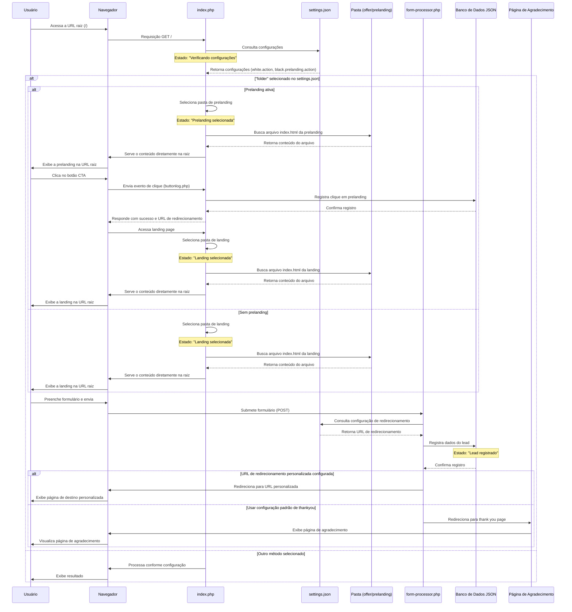

# Diagrama de Sequência para Acesso Direto a Landing Pages na Raiz



## Solução Implementada

A solução implementada permite o acesso direto aos arquivos das pastas de landing e prelanding diretamente na raiz do site, sem a necessidade de redirecionamentos ou uso de subpastas. Além disso, um processador de formulário centralizado elimina a necessidade de ter um arquivo `order.php` em cada pasta de landing.

### Principais Componentes:

1. **Acesso Direto na Raiz:** O arquivo `index.php` foi modificado para servir os arquivos diretamente na raiz, removendo a base href e outros elementos que poderiam interferir.

2. **Processador de Formulário Centralizado:** Um arquivo `form-processor.php` na raiz processa os formulários de qualquer landing page, eliminando a necessidade de ter um arquivo `order.php` em cada pasta.

3. **URL de Redirecionamento Personalizada:** Foi adicionado um campo na interface administrativa para definir uma URL de redirecionamento personalizada após o preenchimento do formulário.

## Análise do Estado de Transição

| Estado | Descrição | Evento de Transição | Próximo Estado |
|--------|-----------|---------------------|----------------|
| Verificando configurações | Sistema carrega settings.json | Identificação do modo "folder" | Prelanding/Landing selecionada |
| Prelanding selecionada | Exibição da prelanding na raiz | Clique no botão CTA | Landing selecionada |
| Landing selecionada | Exibição da landing na raiz | Envio do formulário | Lead registrado |
| Lead registrado | Dados armazenados no BD | Redirecionamento | Visualização da página de agradecimento |

## Fontes de Dados Envolvidas

1. **settings.json**
   - Principais configurações: 
     - `white.action`: Define o método para white page
     - `black.prelanding.action`: Define o método para prelanding
     - `black.landing.action`: Define o método para landing
     - `black.landing.folder.redirect_url`: URL personalizada para redirecionamento após formulário

2. **Banco de Dados JSON**
   - Localização: `/logs/leads/` - Armazena informações dos leads registrados
   - Formato dos dados:
   ```json
   {
     "subid": "subid_123456789",
     "name": "Nome do Cliente",
     "email": "email@exemplo.com",
     "phone": "123456789",
     "landing": "offer2",
     "prelanding": "preland1",
     "status": "Lead",
     "timestamp": "2023-08-15T12:34:56Z"
   }
   ```

## Detalhes das Requisições

### Acesso à Landing/Prelanding:
- **Requisição**: 
  - Método: `GET`
  - URL: `/` ou qualquer arquivo na raiz
  
- **Resposta**: 
  - Conteúdo do arquivo solicitado servido diretamente na raiz

### Envio do Formulário:
- **Requisição**: 
  - Método: `POST`
  - URL: `/form-processor.php`
  - Dados: `name=User&email=email@exemplo.com&phone=123456789`
  
- **Processamento**: 
  1. Validação dos dados
  2. Registro do lead no banco de dados
  3. Consulta da URL de redirecionamento nas configurações
  4. Redirecionamento para a URL configurada ou thank you page padrão
</rewritten_file> 