# Diagrama de Sequência - Prelanding com Ação "folder"

## Descrição do Caso de Uso

Este documento descreve como o sistema trata requisições quando a configuração
`prelanding.action` está definida como `"folder"`. Nessa configuração, o
conteúdo de uma pasta especificada (ex: "preland1") é servido diretamente na URL
raiz do site, sem redirecionamento ou mudança de URL.

## Diagrama de Sequência Atualizado

```mermaid
sequenceDiagram
    participant U as Usuário
    participant S as Servidor Web
    participant I as index.php
    participant SF as serve_file()
    participant BL as buttonlog.php
    participant C as Cloaker/TDS
    participant AB as Sistema de AB Testing
    participant JS as settings.json
    participant DB as Base de Dados
    participant P as Pasta Prelanding
    participant L as Pasta Landing
    participant CK as Cookies

    U->>S: Requisição para URL raiz (/)
    S->>I: Processa requisição
    I->>JS: Lê configurações
    JS-->>I: Configurações:<br/>prelanding.action="folder"<br/>folders=["preland1", "preland2"]<br/>landing.action="folder"<br/>landings=["site3", "site4"]
    I->>C: Verifica filtros TDS (se habilitados)
    C-->>I: Resultado da verificação: 0 (usuário normal)
    
    rect rgb(22, 32, 22)
    Note over I,SF: Verificação Prioritária de Prelanding
    I->>I: Verifica se black_preland_action="folder"
    
    I->>AB: Seleciona prelanding aleatória
    AB-->>I: Retorna prelanding escolhida
    I->>CK: Define cookie 'prelanding'
    
    I->>DB: Registra visualização com subID
    
    I->>SF: Chama serve_file(folder, requested_file)
    SF->>P: Busca conteúdo da pasta prelanding
    P-->>SF: Retorna conteúdo (index.html, etc)
    
    SF->>SF: Processa arquivo HTML
    Note over SF: Adiciona tag <base>
    Note over SF: Adiciona script de tracking
    Note over SF: Modifica links para usar buttonlog.php
    
    SF-->>I: Retorna conteúdo processado
    I-->>U: Exibe prelanding na URL raiz
    
    Note over U,BL: Interação com Prelanding
    U->>BL: Clica CTA (POST /buttonlog.php)
    BL->>DB: Registra evento de clique
    BL->>AB: Seleciona landing aleatória
    AB-->>BL: Retorna landing escolhida
    BL->>CK: Define cookie 'landing'
    BL-->>U: Retorna JSON com URL de redirecionamento
    
    U->>S: Navega para landing selecionada
    S->>I: Processa requisição
    I->>SF: Chama serve_file(landing_folder, requested_file)
    SF->>L: Busca conteúdo da pasta landing
    L-->>SF: Retorna conteúdo da landing
    SF-->>I: Retorna conteúdo processado
    I-->>U: Exibe landing page
    end
```

## Fluxo de Dados Detalhado

1. **Requisição Inicial**:
   - Usuário acessa a URL raiz do site (ex: `https://dominio.com/`)
   - O servidor redireciona a requisição para `index.php`

2. **Processamento em index.php**:
   - Carrega dependências: core.php, settings.php, db.php, main.php
   - Lê configurações do arquivo settings.json
   - Identifica as configurações de prelanding e landing

3. **Verificação TDS (se habilitada)**:
   - O sistema inicializa o objeto Cloaker com os parâmetros de configuração
   - Executa a verificação para determinar se o visitante é um bot/moderador
   - Para usuários normais (resultado 0), continua o processamento

4. **Priorização da Prelanding**:
   - Verifica primeiro se `$black_preland_action === 'folder'`
   - Se verdadeiro, processa a prelanding em vez da landing

5. **Seleção de Prelanding**:
   - Se o cookie 'prelanding' já existir, usa o valor salvo
   - Caso contrário, seleciona aleatoriamente uma das pastas em
     `$black_preland_folder_names`
   - Define o cookie 'prelanding' com o valor selecionado

6. **Registro de Visualização**:
   - Gera um subID único para o visitante se não existir
   - Registra a visualização no banco de dados com informações de detecção

7. **Servindo o Conteúdo**:
   - Chama a função `serve_file()` com a pasta prelanding e o arquivo solicitado
   - Para arquivos HTML, adiciona uma tag `<base>` para garantir links relativos
   - Adiciona script JavaScript para rastrear cliques em botões CTA
   - Retorna o conteúdo processado para o usuário

8. **Interação do Usuário**:
   - Quando o usuário clica no botão CTA, o JavaScript envia uma requisição POST
     para `buttonlog.php`
   - Envia dados JSON com o evento, nome da prelanding e timestamp

9. **Processamento do Clique**:
   - `buttonlog.php` registra o evento no arquivo de log
   - Seleciona uma landing page (site3 ou site4) conforme configuração
   - Define um cookie 'landing' com a escolha
   - Retorna um JSON com a URL para redirecionamento

10. **Navegação para Landing**:
    - O JavaScript redireciona o usuário para a landing page
    - O sistema serve os arquivos da pasta landing selecionada

## Estados do Sistema

1. **Inicialização**: Carregamento de configurações e dependências
2. **Verificação de Usuário**: Filtros TDS determinam o tipo de visitante
3. **Seleção de Conteúdo**: Escolha da prelanding a ser exibida
4. **Servindo Prelanding**: Exibição do conteúdo na URL raiz
5. **Rastreamento de Interação**: Registro do clique no CTA
6. **Transição**: Redirecionamento para landing page
7. **Conversão**: Interação com a landing page

## Troca de Dados

- **Requisição do Usuário → Servidor**: URL, User-Agent, IP, cookies
- **settings.json → index.php**: Configurações de prelanding e landing
- **index.php → Base de Dados**: Registros de visualizações
- **index.php → Usuário**: Conteúdo HTML processado da prelanding
- **Usuário → buttonlog.php**: Dados do evento de clique (JSON)
- **buttonlog.php → Log**: Registro do evento em arquivo de log
- **buttonlog.php → Usuário**: URL de redirecionamento (JSON)

## Detalhes de Implementação da Função serve_file()

1. **Normalização de Caminhos**:
   - Previne directory traversal removendo '..' do caminho
   - Remove barras iniciais para garantir caminho relativo

2. **Determinação do Tipo de Arquivo**:
   - Se nenhum arquivo for especificado, usa 'index.html'
   - Se for um diretório, busca 'index.html' ou 'index.php'

3. **Definição de Tipos MIME**:
   - Identifica a extensão do arquivo e define o cabeçalho Content-Type
     apropriado
   - Configura cabeçalhos de cache específicos para arquivos estáticos e
     dinâmicos

4. **Processamento Especial para HTML**:
   - Adiciona tag `<base>` para garantir funcionamento de links relativos
   - Adiciona evento onclick ao botão CTA para tracking
   - Insere script JavaScript para envio de dados ao buttonlog.php

5. **Tratamento de Arquivos PHP**:
   - Inclui o arquivo PHP para execução no contexto atual
   - Mantém variáveis e ambiente disponíveis
