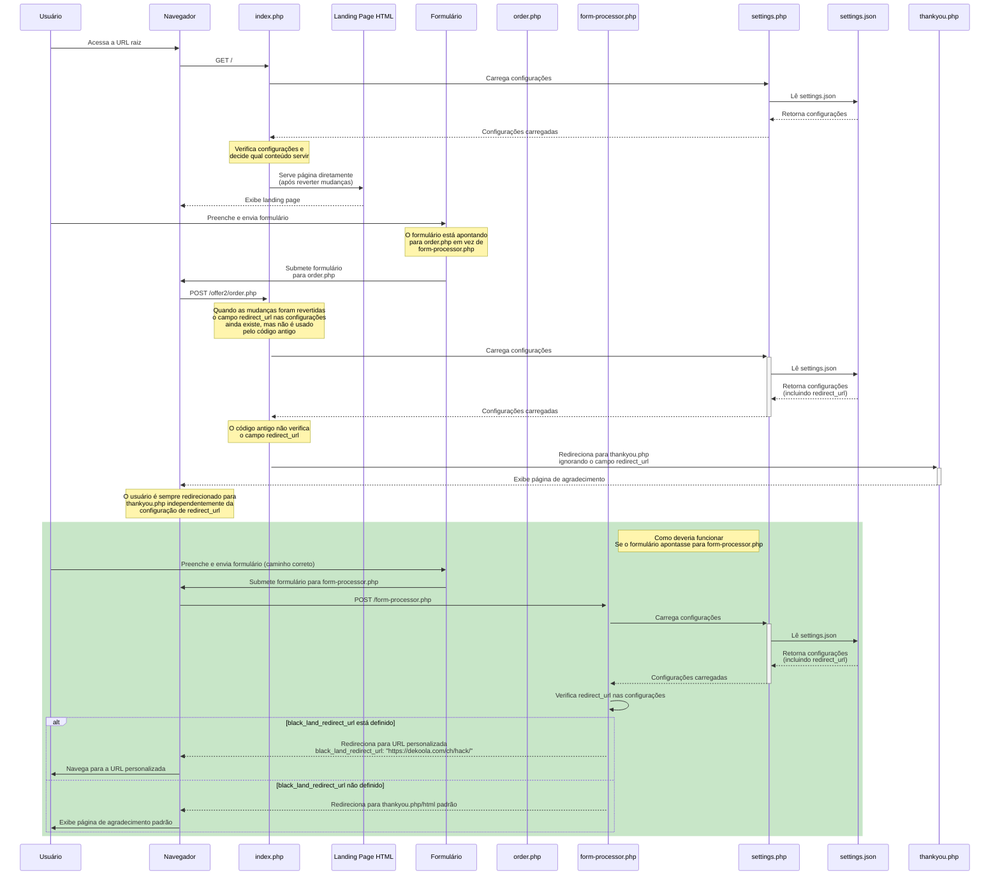

# Análise do Problema: Redirecionamento Incorreto após Submissão de Formulário

## Problema

O sistema não está redirecionando os usuários para a URL personalizada configurada em `black.landing.folder.redirect_url` no arquivo `settings.json` após o preenchimento do formulário. Em vez disso, os usuários são sempre redirecionados para `/thankyou.php`.

## Causa Raiz Identificada

1. **Conflito de Rotas**: Os formulários nas landing pages estão apontando para o antigo arquivo `order.php` em vez do novo processador centralizado `form-processor.php`.

2. **Código Legado**: O arquivo `order.php` não foi atualizado para verificar o campo `redirect_url` nas configurações, então ele sempre redireciona para `/thankyou.php`.

3. **Configuração Incorreta**: Há uma duplicidade na configuração de redirecionamento:
   - `black.landing.folder.redirect_url` (usado pelo novo processador)
   - `black.landing.folder.redirect.url` (definido no JSON, mas não utilizado)

## Solução Proposta

1. **Atualizar a Configuração**:
   - Remover a duplicidade no arquivo `settings.json`
   - Unificar todas as configurações de redirecionamento em um único caminho

2. **Atualizar os Formulários**:
   - Modificar os formulários HTML nas landing pages para apontar para `/form-processor.php` em vez de `order.php`
   - Esse é o passo mais importante, pois só assim o processador centralizado será usado

3. **Proxy Temporário**:
   - Implementar um proxy em `offer2/order.php` que redirecione para `form-processor.php` 
   - Isso evitará a necessidade de alterar todos os formulários imediatamente

## Monitoramento e Verificação

Para verificar se a solução está funcionando:

1. Verificar os logs de acesso para confirmar que o `form-processor.php` está sendo chamado
2. Monitorar os redirecionamentos para garantir que os usuários estão sendo enviados para a URL correta
3. Testar diferentes configurações para validar o comportamento correto em todos os cenários

## Estado das Transições

| Estado | Evento | Próximo Estado | Condição |
|--------|--------|----------------|----------|
| Exibindo landing page | Submissão do formulário | Processando formulário | - |
| Processando formulário | Validação bem-sucedida | Redirecionando | Dados válidos |
| Redirecionando | Verificação de configuração | Exibindo URL personalizada | `black_land_redirect_url` não vazio |
| Redirecionando | Verificação de configuração | Exibindo página de agradecimento padrão | `black_land_redirect_url` vazio |
``` 