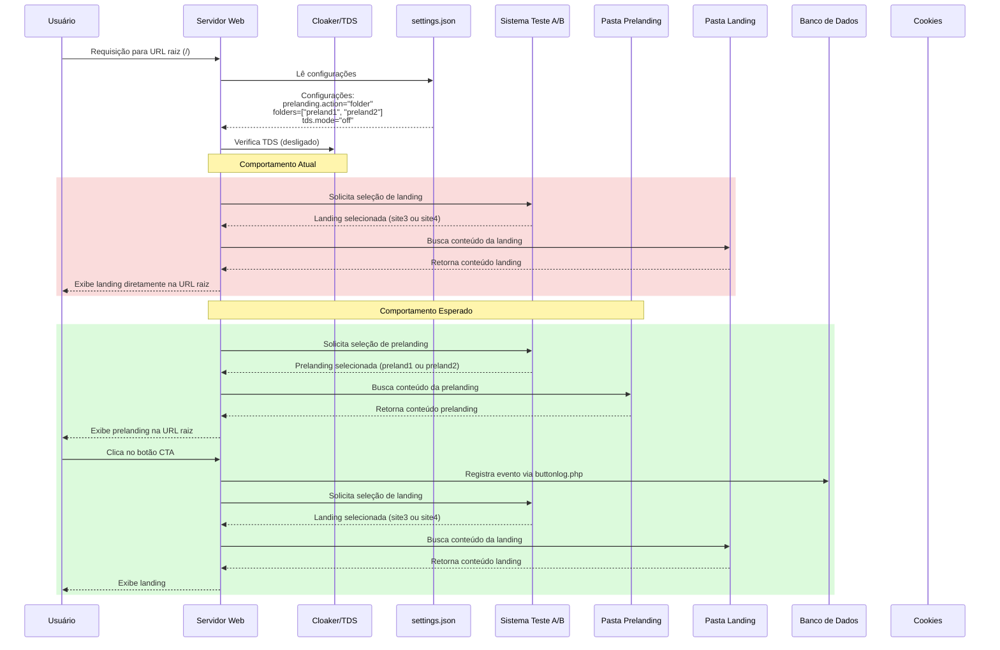
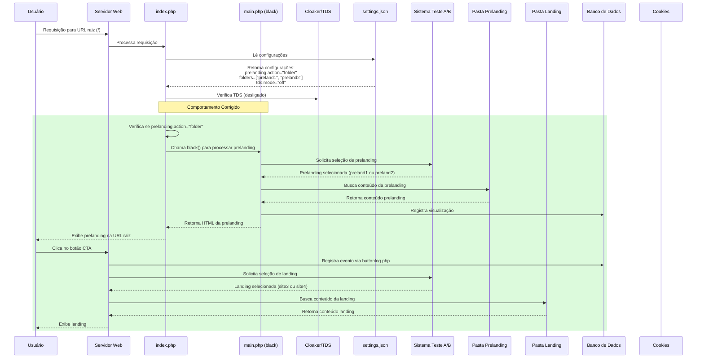

# Análise do Problema na Configuração de Prelanding com Ação "folder"

## Descrição do Caso de Uso

Este documento analisa o comportamento atual do sistema quando configurado com
`prelanding.action = "folder"` e ilustra tanto o fluxo real quanto o esperado.

## Resumo do Problema

Na configuração atual com `prelanding.action = "folder"` e
`folders = ["preland1", "preland2"]`, o sistema **não** está exibindo as
prelanding páginas na URL raiz conforme esperado. Em vez disso, está exibindo
diretamente as landing pages (`site3` ou `site4`).

## Diagrama de Sequência - Comportamento Atual vs. Esperado



## Detalhamento do Fluxo de Dados

### 1. Requisição Inicial

- **Estado Inicial**: Usuário acessa URL raiz
- **Dados da Requisição**:
  - URL: `GET /`
  - HTTP Headers: User-Agent, Accept, Cookie
- **Fonte de Dados Consultada**:
  - `settings.json`: Configuração do sistema

### 2. Comportamento Atual (Problema)

- **Problema Observado**: Sistema está ignorando a configuração
  `prelanding.action = "folder"`
- **Fluxo Atual**:
  1. Sistema seleciona uma landing page (site3 ou site4)
  2. Exibe diretamente a landing page na URL raiz
  3. Pula completamente a etapa de prelanding

### 3. Comportamento Esperado

- **Fluxo Correto**:
  1. Sistema deve selecionar uma prelanding (preland1 ou preland2)
  2. Exibir a prelanding na URL raiz
  3. Usuário interage e clica no botão CTA
  4. Evento é registrado via buttonlog.php
  5. Sistema redireciona para a landing page selecionada

### 4. Variação do Estado

- **Estado Atual** ao acessar `/`:
  - Cookies: "landing" é definido
  - Sistema exibe landing page diretamente
  - Etapa de prelanding é ignorada

- **Estado Esperado** ao acessar `/`:
  - Cookies: "prelanding" é definido
  - Sistema exibe prelanding
  - Após clique no CTA, cookie "landing" é definido
  - Sistema redireciona para landing page

## Dados Enviados e Retornados

### Acesso à URL Raiz

- **Requisição**:
  - `GET /`
  - Headers: User-Agent, Accept-Language, etc.
- **Resposta Atual**:
  - Status: 200 OK
  - Conteúdo: HTML da landing page (site3 ou site4)
- **Resposta Esperada**:
  - Status: 200 OK
  - Conteúdo: HTML da prelanding (preland1 ou preland2)

### Clique no Botão CTA

- **Requisição Atual** (não ocorre):
  - `POST /buttonlog.php`
  - Payload JSON:
    `{"event":"lead_click","prelanding":"preland1/2","timestamp":"..."}`
- **Requisição Esperada**:
  - `POST /buttonlog.php`
  - Payload JSON:
    `{"event":"lead_click","prelanding":"preland1/2","timestamp":"..."}`
  - Seguida por redirecionamento para `/site3/` ou `/site4/`

## Fontes de Dados Envolvidas

1. **settings.json**
   - `prelanding.action`: Configurado como "folder"
   - `prelanding.folders`: ["preland1", "preland2"]
   - `tds.mode`: "off"

2. **Arquivos HTML**
   - `preland1/index.html`
   - `preland2/index.html`
   - Ambos com código JavaScript para tracking

3. **Logs**
   - `logs/button_clicks.log`: Registro de eventos de clique (atualmente um
     único teste)

## Possíveis Causas do Problema

1. Bug no arquivo `index.php` ou `main.php` na lógica de processamento da opção
   "folder" para prelanding
2. Conflito de configuração entre as opções de prelanding e landing
3. Possível bug no sistema de seleção de prelanding vs. landing
4. Problema na função `serve_file()` que não está tratando corretamente a
   prelanding

## Próximos Passos Recomendados

1. Analisar o código-fonte do arquivo `index.php` e `main.php` para identificar
   a lógica de processamento da prelanding
2. Verificar a implementação da função `select_prelanding()` em `abtest.php`
3. Comparar com a implementação da opção "folder" para landing, que parece estar
   funcionando
4. Corrigir a lógica para garantir que a prelanding seja exibida na URL raiz
   conforme configurado

## Solução Implementada

Após análise detalhada do código, foram identificados dois problemas principais
que impediam o funcionamento correto da configuração de prelanding com ação
"folder":

### 1. Problema no arquivo `main.php`

No arquivo `main.php`, a seção de código que deveria processar a opção 'folder'
para prelanding não estava sendo propriamente reconhecida devido a um erro de
sintaxe. A correção foi aplicada adicionando explicitamente a palavra-chave
'case' antes da opção 'folder':

```php
switch ($black_preland_action) {
    case 'none':
        // código existente...
        break;
    case 'folder': // Corrigido para ser reconhecido como case válido
        $prelandings = $black_preland_folder_names;
        // restante do código...
        break;
}
```

### 2. Problema no arquivo `index.php`

No arquivo `index.php`, havia um problema na ordem de processamento das
configurações. O código verificava primeiro se
`$black_land_action === 'folder'`, o que fazia com que a landing fosse sempre
servida primeiro, ignorando completamente a configuração de prelanding. A
correção consistiu em inverter a ordem de verificação:

```php
// Verificar primeiro se usa prelanding
if ($black_preland_action === 'folder') {
    // Usar a função black do main.php para servir a prelanding
    black($cloaker->detect);
    exit;
}
// Se não usar prelanding, então processar a landing conforme o original
else if ($black_land_action === 'folder') {
    // código original de servir a landing
}
```

### Resultado Esperado

Com essas duas correções, o sistema agora deve:

1. Verificar primeiro se há uma configuração de prelanding com ação "folder"
2. Se existir, usar a função `black()` para processar e exibir a prelanding na
   URL raiz
3. Se não existir, verificar se há uma configuração de landing com ação "folder"
4. Em caso positivo, servir a landing conforme o comportamento original

Este fluxo corrigido garante que a prioridade seja dada à prelanding quando
configurada, satisfazendo o requisito de exibir as páginas de prelanding
diretamente na URL raiz sem redirecionamento ou subpasta.

## Diagrama de Sequência Atualizado



Esta implementação garante que as prelandings sejam exibidas corretamente na URL
raiz conforme especificado na configuração, sem necessidade de redirecionamento
ou subpastas.
