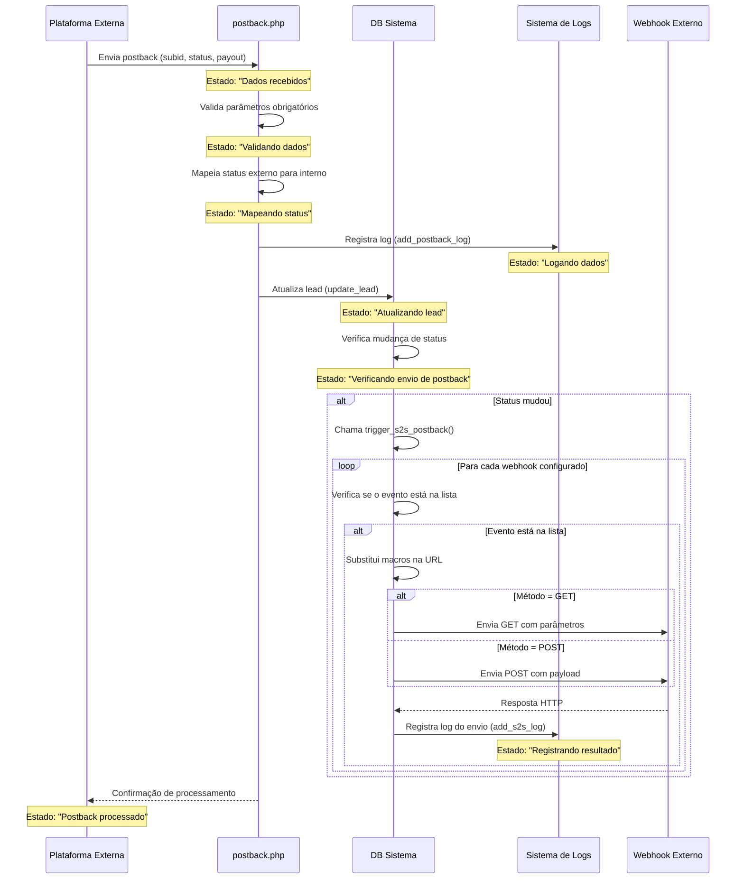

# Diagrama de Sequência: Processamento de Postbacks entre Sistema e Plataformas Externas



## Detalhes do Fluxo

### Estados do Sistema

| Estado | Descrição | Dados |
|--------|-----------|-------|
| Dados recebidos | O sistema recebe um postback de uma plataforma externa | `subid`, `status`, `payout` |
| Validando dados | O sistema verifica se todos os parâmetros obrigatórios estão presentes | N/A |
| Mapeando status | O sistema converte o status externo para o formato interno | `$status` → `$inner_status` |
| Logando dados | O sistema registra os dados recebidos no log | Arquivo: `/pblogs/[data].pb.log` |
| Atualizando lead | O sistema atualiza o status do lead no banco de dados | Coleção: `leads` |
| Verificando envio de postback | O sistema verifica se deve enviar um postback S2S | Comparação: `$old_status` vs `$status` |
| Registrando resultado | O sistema registra o resultado do envio do postback S2S | Arquivo: `/pblogs/[data].pb.detailed.log` |
| Postback processado | O sistema informa à plataforma externa que o postback foi processado | Mensagem: "Postback for subid X with status Y accepted" |

### Dados Trocados

#### Recebimento de Postback (Plataforma Externa → postback.php)
```
GET/POST: /postback.php
Parâmetros: 
  - subid: "abc123xyz456"
  - status: "purchase"
  - payout: "97.50"
```

#### Atualização do Lead (postback.php → Banco de Dados)
```
Coleção: leads
Operação: update
Filtro: { "subid": "abc123xyz456" }
Atualização: { 
  "status": "Purchase", 
  "payout": "97.50" 
}
```

#### Envio de Postback S2S (Sistema → Webhook Externo)
**Método POST:**
```
URL: https://webhook-externo.com/api/callback
Headers: [Headers padrão]
Payload: {
  "subid": "abc123xyz456",
  "status": "Purchase",
  "prelanding": "preland1",
  "landing": "offer2",
  "name": "João Silva",
  "email": "joao@example.com",
  "phone": "5511999887766"
}
```

**Método GET:**
```
URL: https://webhook-externo.com/api/callback?subid=abc123xyz456&status=Purchase&prelanding=preland1&landing=offer2&name=João+Silva&email=joao%40example.com&phone=5511999887766
```

#### Resposta do Postback (postback.php → Plataforma Externa)
```
Texto: "Postback for subid abc123xyz456 with status purchase accepted"
``` 