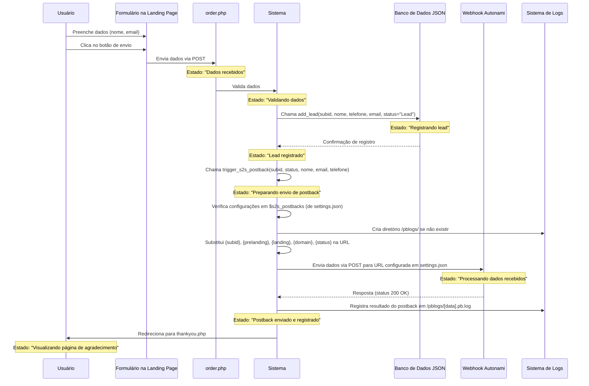

# Diagrama de Sequência: Registro de Lead e Envio de Postback S2S



## Solução Implementada

Após análise do código, implementei as seguintes melhorias para resolver o problema de postbacks:

1. Criei a função `trigger_s2s_postback()` em `db.php` que:
   - Recebe os parâmetros: `$subid`, `$status`, `$name`, `$email` e `$phone`
   - Verifica se existem configurações de postback definidas
   - Cria o diretório `/pblogs/` para armazenar logs de postbacks se não existir
   - Substitui as macros na URL do postback: `{subid}`, `{prelanding}`, `{landing}`, `{domain}`, `{status}`
   - Envia os dados do lead por POST ou GET conforme definido em settings.json
   - Registra o resultado do envio em logs detalhados

2. Modifiquei as seguintes funções para chamar `trigger_s2s_postback()`:
   - `add_lead()`: Agora envia postback após o registro inicial do lead
   - `update_lead()`: Envia postback quando o status do lead é alterado
   - `update_lead_status()`: Também envia postback na atualização de status
   - `add_email()`: Envia postback quando um email é adicionado ao lead

## Fontes de Dados Envolvidas

1. **Banco de Dados JSON**
   - Localização: `/logs/leads/`
   - Armazena dados de leads por meio da função `add_lead()`
   - Estrutura:
     ```json
     {
       "subid": "identificador_único",
       "time": 1718245836,
       "name": "Nome do Usuário",
       "phone": "00000000000",
       "email": "email@exemplo.com",
       "status": "Lead",
       "fbp": "",
       "fbclid": "",
       "preland": "preland2",
       "land": "offer2"
     }
     ```

2. **Configuração de Postback**
   - Localização: `settings.json`
   - Seção relevante:
     ```json
     "postback": {
       "lead": "Lead",
       "purchase": "Purchase",
       "reject": "Reject",
       "trash": "Trash",
       "s2s": [
         {
           "url": "https://dekoola.com/wp-json/autonami/v1/webhook/?bwfan_autonami_webhook_id=10&bwfan_autonami_webhook_key=92c39df617252d128219dba772cff29a",
           "method": "POST",
           "events": ["Lead", "Purchase", "Reject", "Trash"]
         }
       ]
     }
     ```

3. **Logs de Postback**
   - Localização: `/pblogs/[data].pb.log`
   - Formato: `YYYY-MM-DD HH:MM:SS METHOD URL STATUS HTTP_CODE`
   - Exemplo:
     ```
     2023-06-13 15:45:23 POST https://dekoola.com/wp-json/autonami/v1/webhook/?bwfan_autonami_webhook_id=10&bwfan_autonami_webhook_key=92c39df617252d128219dba772cff29a Lead HTTP 200
     ```

## Detalhes das Requisições e Respostas

### Formulário para Sistema
- **Método**: `POST`
- **URL**: `/offer2/order.php`
- **Corpo**:
  ```
  name=Nome&email=email@exemplo.com&phone=123456789
  ```
- **Cookies**: `subid=67d8d028a6bb5&landing=offer2&prelanding=preland2`

### Sistema para Webhook (implementação atual)
- **Método**: `POST` (ou `GET` conforme configurado)
- **URL**: `https://dekoola.com/wp-json/autonami/v1/webhook/?bwfan_autonami_webhook_id=10&bwfan_autonami_webhook_key=92c39df617252d128219dba772cff29a`
- **Payload**:
  ```json
  {
    "subid": "67d8d028a6bb5",
    "status": "Lead",
    "prelanding": "preland2",
    "landing": "offer2",
    "name": "Nome",
    "email": "email@exemplo.com",
    "phone": "123456789"
  }
  ```

## Análise de Estado

| Estado | Descrição | Próximo Estado |
|--------|-----------|----------------|
| Dados recebidos | O servidor recebe os dados do formulário | Validando dados |
| Validando dados | O sistema valida os dados enviados | Registrando lead |
| Registrando lead | O sistema armazena o lead no banco de dados | Lead registrado |
| Lead registrado | O lead foi salvo com sucesso no banco de dados | Preparando envio de postback |
| Preparando envio de postback | O sistema prepara os dados para o webhook | Postback enviado |
| Postback enviado e registrado | O sistema confirma o envio do postback e registra o resultado | Visualizando página de agradecimento |
| Visualizando página de agradecimento | Usuário vê confirmação de envio do formulário | Fim | 